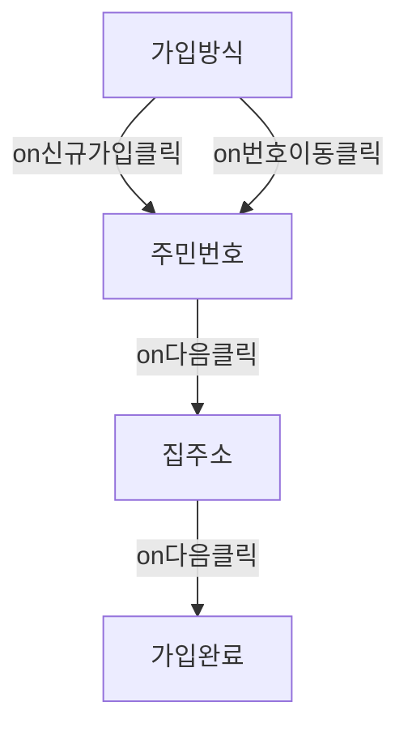

# 23.06.09

## 오늘 한 일

- [ ] 알고리즘 문제 풀이
- [x] 카공실록 MVP 발표 전 스퍼트
  - API 연결
  - 카페 상세 페이지 Map 추가
  - Map 렌더링 개선
  - Loading 컴포넌트 추가
  - 기타 style 수정

---

## SLASH 23 - 퍼널:쏟아지는 페이지 한 방에 관리하기

토스의 SLASH 23에서 발표한 [퍼널:쏟아지는 페이지 한 방에 관리하기](https://www.youtube.com/watch?v=NwLWX2RNVcw&pp=ygUM7Y2864SQIHNsYXNo)를 봤다.

퍼널은 깔때기라는 뜻으로, 사용자가 어떤 행동을 할 때까지의 과정을 말한다.

> 회원 가입 첫 페이지 진입 -> 이름 입력 -> 주민번호 입력 -> 마케팅 수신동의 -> 가입 축하 페이지

퍼널을 관리하기 위해 토스에서 `useFunnel`이라는 라이브러리를 만들어서 사용하고 있다.

1. 응집도 개선
   > 연관된 코드는 가까운 곳에 배치하자

회원가입 상태를 전역이 아닌 지역 상태로 바꾸고, step 또한 지역 상태로 두어 step에 따라 조건부 렌더링 되도록 했다.

```tsx
const [registerData, setRegisterData] = useState();
const [step, setStep] = useState<'가입방식' | '주민번호' | '집주소' | '가입성공'>('가입방식');

return (
  <main>
    {step === '가입방식' && <가입방식 onNext={(data) => setStep('주민번호')} />}
    {step === '주민번호' && <주민번호 onNext={(data) => setStep('집주소')} />}
    {step === '집주소' && <집주소 onNext={(data) => setStep('가입성공')} />}
    {step === '가입성공' && <가입성공 />}
  </main>
);
```

이로써 UI의 흐름을 한 공간에서 관리할 수 있게 되었다.

디자인 스펙 변경되어도 유연하게 대응 가능하게 되었다.

2. 라이브러리로 추상화하기
   > 추상화를 통해 코드를 간결하게 만들자

```tsx
// useFunnel.tsx
function useFunnel() {
  const [step, setStep] = useState();

  const Step = (props) => {
    return <>{props.children}</>;
  };

  const Funnel = ({ children }) => {
    //name이 현재 step 상태와 동일한 Step만 렌더링
    const targetStep = children.find((childStep) => childStep.props.name === step);
    return Object.assign(targetStep, { Step });
  };
  return [Funnel, setStep];
}
```

`Object.assign`을 통해 `Funnel` 컴포넌트에 `Step` 컴포넌트를 추가한다는게 신선했다. 이렇게 해도 Compound Component를 만들 수 있다는 것을 알게 되었다.

> 변경 후

```tsx
const [registerData, setRegisterData] = useState();
const [step, setStep] = useState<'가입방식' | '주민번호' | '집주소' | '가입성공'>('가입방식');

return (
  <Funnel>
    <Funnel.step name='가입방식'>
      <가입방식 onNext={(data) => setStep('주민번호')} />
    </Funnel.step>
    <Funnel.step name='주민번호'>
      <주민번호 onNext={(data) => setStep('집주소')} />
    </Funnel.step>
    // ...
  </Funnel>
);
```

다양한 상황에서 일관적으로 개발할 수 있다! -> 라이브러리화 가능

3. 퍼널 흐름 - 개발자 도구로 시각화하기

이건 진짜 신기했다. 리액트 쿼리 쓸 때 썼던 `react-query-devtools`처럼 퍼널 흐름을 개발자 도구로 시각화할 수 있다.

시각화를 통해 스텝 간에 이동할 때 흐름을 파악하기 쉬워진다.

`Mermaid` 다이어그램 라이브러리를 사용해서 구현했다고 한다.

```tsx
<Funne1.Step name="가입방식">
  <가입방식
    on신규가입클릭={() => setStep("주민번호" )}
    on번호이동클릭={() => setStep ("주민번호")}
  />
</Funnel.Step>
<Funnel.Step name="주민번호">
  <주민번호 on다음클릭={() => {
   if (emptyHomeAdress) {
      setStep ("집주소")
    } else {
      setStep ("가입완료")
    }
  }}
  />
</Funnel.Step>
```

```md
graph TD
가입방식[가입방식] --> |on신규가입클릭| 주민번호[주민번호]
가입방식[가입방식] --> |on번호이동클릭| 주민번호[주민번호]
주민번호[주민번호] --> |on다음클릭| 집주소[집주소]
집주소[집주소] --> |on다음클릭| 가입완료[가입완료]
```



> Step들을 받고 반목문을 돌리는 코드

```tsx
function getGraph(step: string, children: ReactElement[]) {
  const result: string[] = ['graph TD'];

  children.map((stepElement) => {
    const stepName = stepElement.props.name;
    const children = stepElement.props.children;

    const childrenProps = children?.props as [string, unknown];
    Object.entries(childrenProps).map((el) => {
      const [functionName, value] = el;
      if (typeof value === 'function') {
        value
          .toString()
          .match(/ setStep\(.+\)/g)
          ?.map((matchedSetStep) => {
            const matchedStepName = matchedSetStep.match(/setStep\((?:'|")(.+)(?:'|")\)/)?.[1];
            const graphNode = `${stepName}[${stepName}] -->|${functionName}| ${matchedStepName}[${matchedStepName}]`;
            result.push(graphNode);
          });
      }
    });
  });

  return result.join('\n');
}
```

`Funnel Debugger`

그래프가 화면을 가리지 않도록 위치를 Chrome Devtools로 이동했다고 한다.

### 정리

1. 퍼널이라는 패턴 있음
2. 페이지 흐름, 상태를 응집시켜 놓으면 유지보수하기 편함
3. 라이브러리로 추상화해두면 새안성이 높아지고 기능 추가하기 편함
4. 코드가 아닌 개발자 경험도 개선 가능

### 한줄평

> 미쳤다... 이게 토스?

### 새로 알게된 점

- 개발자 도구도 만들 수 있구나
- 연관된 코드들은 응집시켜놓으면 유지보수하기 편하다!!

- `Object.assign`을 통해 `Funnel` 컴포넌트에 `Step` 컴포넌트를 추가할 수 있다는게 신선했다. 이렇게 해도 Compound Component를 만들 수 있구나..!
  - 우아하다...! 우아아아아아

## 카공실록 MVP 발표 전 스퍼트

### API 연결

노션에 적어두었던 API 명세와 살짝 달라 정의해놓은 타입들을 수정했다.

그에 맞게 리팩토링을 진행했는데 꽤 많이 변경해야 했다.

### 카페 상세 페이지 Map 추가 및 KakaoMap 리팩토링을 통해 렌더링 개선

카페 상세 페이지에 카카오맵을 추가했다.

카페 위치가 맵 가운데로 위치하도록 해야했는데, 기존 `KakaoMap` 컴포넌트가 확장성이 떨어져서 `KakaoMap` 컴포넌트를 리팩토링했다.

> 변경 전 `KakaoMap` 컴포넌트

```tsx
/* eslint-disable @next/next/no-before-interactive-script-outside-document */
'use client';

import { DEFAULT_COORDINATES } from '@/constants/map';
import useGeoLocation from '@/hooks/useGeolocation';
import { usePlacesStore } from '@/store/PlacesState';
import Script from 'next/script';
import { Map, MapMarker } from 'react-kakao-maps-sdk';

const KAKAO_SDK_URL = `//dapi.kakao.com/v2/maps/sdk.js?appkey=${process.env.NEXT_PUBLIC_API_KEY}&autoload=false`;

const KakaoMap = () => {
  const { loaded, error, coordinates } = useGeoLocation();
  const { places } = usePlacesStore();

  if (loaded) {
    <div>loading..</div>;
  }

  if (error) {
    <div>에러</div>;
  }

  return (
    <>
      <Script src={KAKAO_SDK_URL} strategy='beforeInteractive' />
      <Map
        center={coordinates ? { lat: coordinates.lat, lng: coordinates.lng } : DEFAULT_COORDINATES}
        className='h-screen w-full min-w-[360px]'
      >
        {places.map((place) => (
          <MapMarker
            key={place.id}
            position={{
              lat: place.latitude,
              lng: place.longitude,
            }}
            image={{
              src: '/assets/Icons/marker.svg',
              size: {
                width: 36,
                height: 45,
              },
            }}
          />
        ))}
      </Map>
    </>
  );
};

export default KakaoMap;
```

> 변경 후 `KakaoMap` 컴포넌트

```tsx
import { DEFAULT_COORDINATES } from '@/constants/map';
// import useGeoLocation from '@/hooks/useGeolocation';
import { Map, MapMarker } from 'react-kakao-maps-sdk';

import type { Coordinates } from '@/types/coordinates';
import type { PlaceType } from '@/types/place';

interface KakaoMapProps {
  className?: string;
  customCoordinates?: Coordinates;
  places?: PlaceType[];
}

const KakaoMap = ({ className, customCoordinates, places }: KakaoMapProps) => {
  return (
    <>
      <Map center={customCoordinates ?? DEFAULT_COORDINATES} className={className}>
        {places?.map((place) => (
          <MapMarker
            key={place.id}
            position={{
              lat: place.latitude,
              lng: place.longitude,
            }}
            image={{
              src: '/assets/Icons/marker.svg',
              size: {
                width: 36,
                height: 45,
              },
            }}
          />
        ))}
      </Map>
    </>
  );
};

export default KakaoMap;
```

places를 외부에서 받아오도록 변경했고, `customCoordinates`를 받아서 `center`로 설정할 수 있도록 변경했다.

그리고 `useGeolocation` 커스텀 훅이 유저의 현재 위치를 받아오는 훅인데, 이 훅을 사용하면 가져오는 동안 렌더링이 되지 않는 문제가 있었다.

그래서 초기 렌더링 시에는 디폴트 위치로 이동하고, 우측 하단 버튼을 누르면 현재 위치로 이동하도록 구현했다.

### Loading 컴포넌트 추가

우측 하단 버튼 누르면 Loading Lottie가 나오도록 구현했다.

```tsx
'use client';

import * as animationData from '../../public/assets/lotties/prography_motion_loading.json';
import Lottie from 'lottie-react';

export default function Loading() {
  return (
    <div className='fixed top-0 z-50 flex h-screen w-full min-w-[360px] max-w-[448px] items-center justify-center bg-black bg-opacity-40'>
      <Lottie animationData={animationData} loop={true} className='h-16 w-16' />
    </div>
  );
}
```


### 의문

페이지 이동할 때 살짝 느린 감이 없지 않아 있다.

지금 거의 대부분의 컴포넌트를 client component로 만들어두었는데, 좀 분리를 해야겠다.

최대한 fetch하는 로직을 분리해서 진행해야겠다.

---

## 내일 할 일

- 프로그라피 MVP 발표 세션 참여
- 부스트캠프 자기소개서 작성
