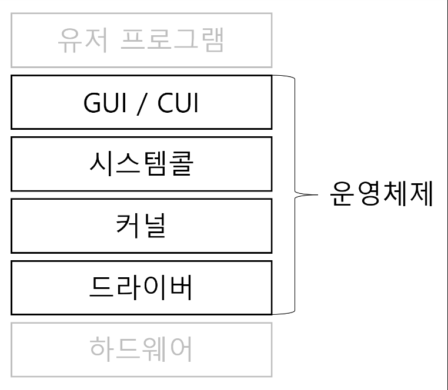
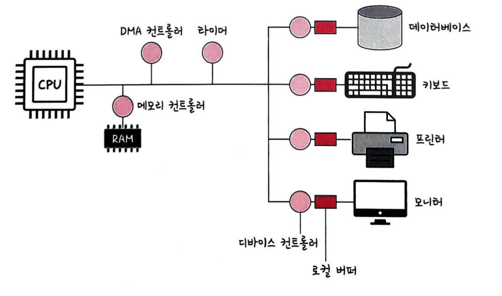
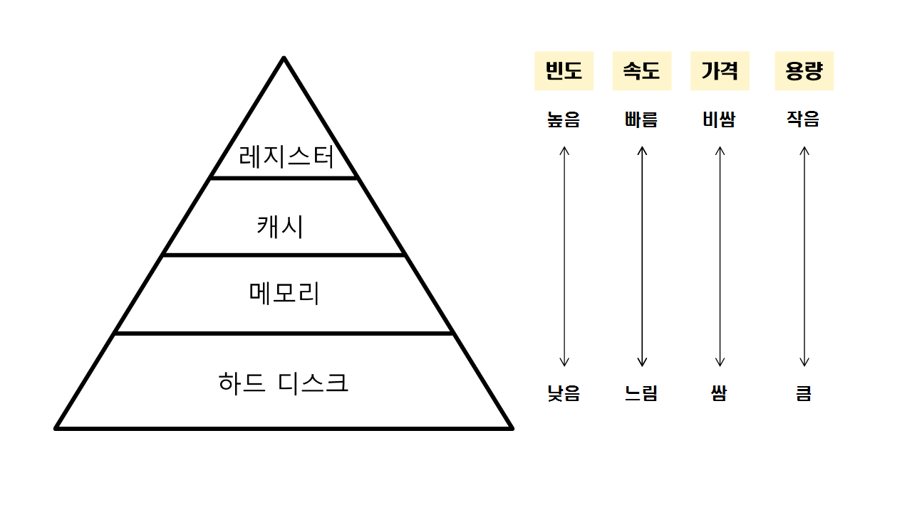
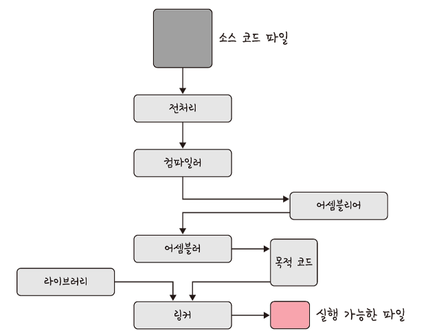
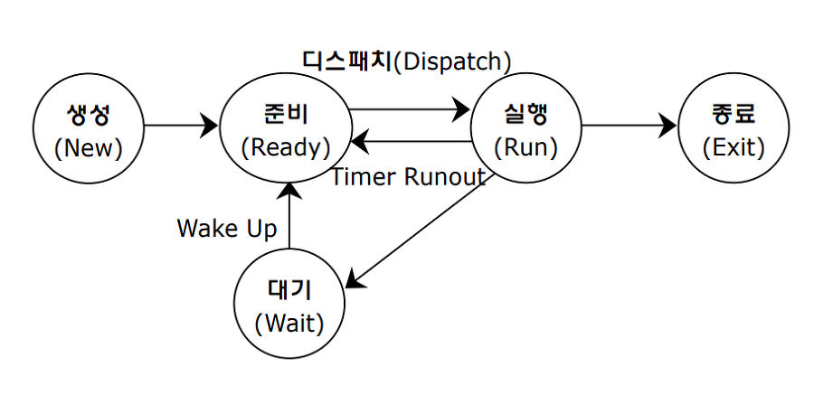
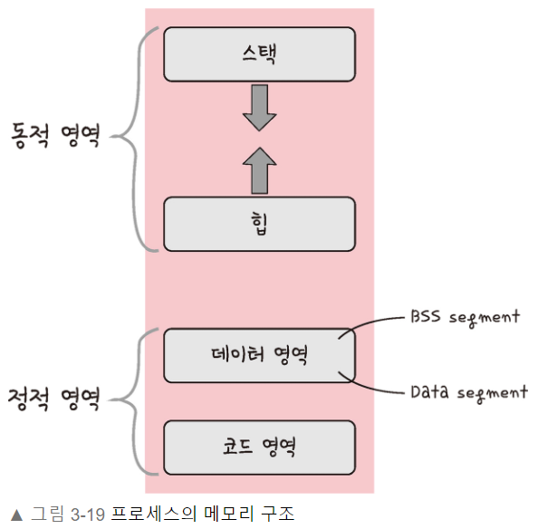
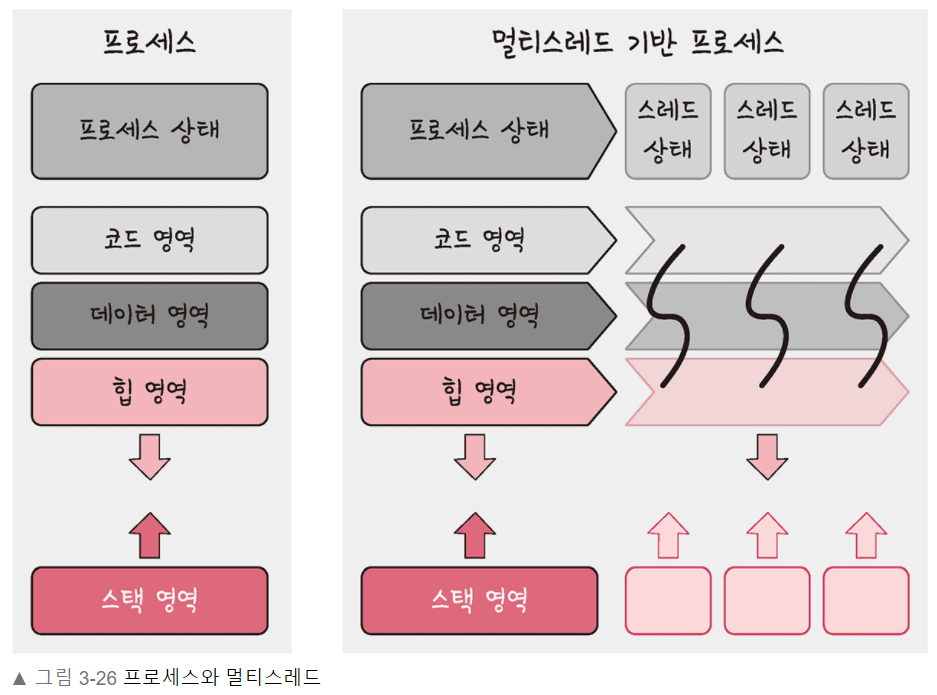
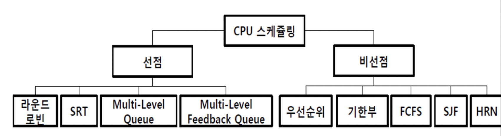

# TIL : 23-06-15
## 오늘 한 일
---
- 면접을 위한 CS 전공지식노트 : Chp3 운영체제

## 면접을 위한 CS 전공지식노트 : Chp3 운영체제
### Section 1 운영체제와 컴퓨터
**3.1.1 운영체제의 역할과 구조**
- 운영체제의 역할   
    1. [CPU 스케줄링](https://vscode.dev/github/Self-Driven-Development/TIL/blob/main/23.06/%EB%AF%BC%EC%84%B8%EB%A6%BC/06-15.md#L46-L47)과 프로세스 관리
    2. [메모리 관리](https://vscode.dev/github/Self-Driven-Development/TIL/blob/main/23.06/%EB%AF%BC%EC%84%B8%EB%A6%BC/06-15.md#L21-L22)
    3. 디스크 파일 관리
    4. I/O 디바이스 관리
- 운영체제의 구조
    
    - GUI : 사용자가 전자장치와 상호 작용할 수 있도록 하는 `사용자 인터페이스`의 한 형태
    - CUI : 그래픽이 아닌 `명령어로 처리하는` 인터페이스
    - 시스템콜 : 운영체제가 `커널에 접근하기 위한` 인터페이스
    - 커널 : `하드웨어와 응용 프로그램 사이의` 인터페이스
    - 드라이버 : `하드웨어를 제어`하기 위한 소프트웨어    

**3.1.2 컴퓨터의 요소**
    

### Section 2 메모리
**3.2.1 메모리 계층**
    
**3.2.2 메모리 관리**
- 가상 메모리
    
- 메모리 할당
    - 연속 할당
    - 불연속 할당
- 페이지 교체 알고리즘

### Section 3 프로세스와 스레드
**3.3.1 프로세스와 컴파일 과정**
    

**3.3.2 프로세스의 상태**
    

**3.3.3 프로세스의 메모리 구조**
    

**3.3.4 PCB**
- 운영체제에서 프로세스에 대한 메타데이터를 저장한 `데이터`

**3.3.5 멀티프로세싱**
- 동시에 두 가지 이상의 일을 수행할 수 있는 것

**3.3.6 스레드와 멀티스레딩**
    

**3.3.7 공유 자원과 임계 영역**
- 공유자원 : 시스템 안에서 각 프로세스, 스레드가 함께 접근할 수 있는 모니터, 프린터, 메모리, 파일, 데이터 등의 `자원이나 변수 등`
- 임계영역 : 둘 이상의 프로세스, 스레드가 공유 자원에 접근할 때 순서 등의 이유로 결과가 달라지는 `코드 영역`

**3.3.8 교착 상태**
- 두 개 이상의 프로세스들이 서로가 가진 자원을 기다릴며 `중단된 상태`

### Section 4 CPU 스케줄링 알고리즘
- CPU 스케줄러 : 프로세스에서 해야 하는 일을 스레드 단위로 CPU에 할당
