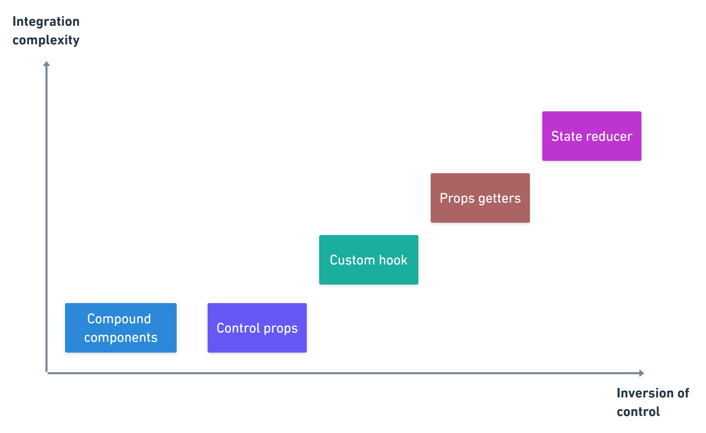

# 23.07.15(토)

## 하루 요약
1. 10시 ~ 11시 : DND 심층 인터뷰 분석
2. 11시 ~ 16시 : Gloddy 개발
3. 17시 ~ 18시, 21 ~ 22시 30분 : Frontend 공부
4. 18시 ~ 18시 30분 : 발음 연습

# 오늘 배운 내용
## 1. [유용한 리액트 패턴 5가지](https://velog.io/@dnr6054/%EC%9C%A0%EC%9A%A9%ED%95%9C-%EB%A6%AC%EC%95%A1%ED%8A%B8-%ED%8C%A8%ED%84%B4-5%EA%B0%80%EC%A7%80?utm_source=pocket_saves)

### 1. Compound Components Pattern
- 예시 코드
```js
import React from "react";
import { Counter } from "./Counter";

function Usage() {
  const handleChangeCounter = (count) => {
    console.log("count", count);
  };

  return (
    <Counter onChange={handleChangeCounter}>
      <Counter.Decrement icon="minus" />
      <Counter.Label>Counter</Counter.Label>
      <Counter.Count max={10} />
      <Counter.Increment icon="plus" />
    </Counter>
  );
}

export { Usage };
```
- 장점
  1. API 복잡도가 낮다. 하나의 거대한 부모 컴포넌트에 모든 prop을 때려넣고 자식 컴포넌트에 꽂아주는 방법보다 각각의 prop이 각각의 서브컴포넌트에 붙어있는 방법이 더 좋음
  2. 좀 더 customizable하고 관심사가 분리 됨
  3. 불필요한 prop drilling 없이 Expressive하고 Declarative한 컴포넌트를 만들 수 있게 도와줌
- 단점
  1. UI 자유도가 너무 큼 => 예상치 못한 행동 유발 가능
  2. JSX가 너무 무겁다. JSX 열 개수가 너무 늘어날 수 있다. 

### 2. Control Props Pattern
- 컴포넌트를 controlled component로 바꿔줌
- 외부 상태는 single source of truth, SSOT로 사용되어 유저로 하여금 커스텀 로직을 삽입할 수 있게 끔 함
  - Controlled Component : component의 상태를 제어할 수 있는 컴포넌트
  - SSOT : 단일 진실 공급원. 모든 데이터 요소를 한 곳에서만 제어, 편집하도록 하는 것
- 예시
```js
import React, { useState } from "react";
import { Counter } from "./Counter";

function Usage() {
  const [count, setCount] = useState(0);

  const handleChangeCounter = (newCount) => {
    setCount(newCount);
  };
  return (
    <Counter value={count} onChange={handleChangeCounter}>
      <Counter.Decrement icon={"minus"} />
      <Counter.Label>Counter</Counter.Label>
      <Counter.Count max={10} />
      <Counter.Increment icon={"plus"} />
    </Counter>
  );
}

export { Usage };
```
- 장점
  1. 더 많은 통제권을 줌. 메인 state가 컴포넌트 바깥에 드러나 있기에 유저는 직접적으로 그 컴포넌트를 컨트롤 할 수 있음
  2. 사용하는 것이 복잡

### 3. Custom Hook Pattern
```js
const { count, handleIncrement, handleDecrement } = useCounter(0);
```
- 장점
  1. 더더욱 많은 제어권을 줌. 유저는 이제 hook과 JSX사이에 자신만의 로직을 넣을 수 있음
- 단점
  1. 사용하는 것이 더 복잡함. 로직이 렌더링하는 부분과 분리되어 있는데, 유저는 둘을 이어줘야 함

### 4. Props Getters Pattern
- Custom Hook Pattern의 복잡도를 감싸기 위해 시도
- native props를 노출하는 대신 props getters의 목록을 제공
```js
const {
  count,
  getCounterProps,
  getIncrementProps,
  getDecrementProps
} = useCounter({
  initial: 0,
  max: MAX_COUNT
});
```
- 장점
  1. 사용하기 쉬움. 
- 단점
  1. 잘 보이지 않음. 
### 5. reducer 패턴
- IoC에 있어 최고의 패턴. 유저에게 컴포넌트를 내부적으로 제어할 수 있는 더 발전된 방법을 제시
```js
  const reducer = (state, action) => {
    switch (action.type) {
      case "decrement":
        return {
          count: Math.max(0, state.count - 2) //The decrement delta was changed for 2 (Default is 1)
        };
      default:
        return useCounter.reducer(state, action);
    }
  };

  const { count, handleDecrement, handleIncrement } = useCounter(
    { initial: 0, max: 10 },
    reducer
  );
  ```
- 장점
  1. 더 많은 통제권을 줌
  2. 모든 action은 외부에서 접근 가능, 오버라이드 가능
- 단점
  1. 유저와 개발자 모두에게 가장 복잡한 패턴
  2. reducer의 액션이 바뀔 수 있기에 컴포넌트 내부 로직에 대한 깊은 이해 필요


- 결론
  - 컴포넌트에게 더 많은 제어권을 주면 plug and play라는 사고방식에서 멀어지게 됨. 그렇기에 올바른 패턴을 선택하는 것은 개발자로서의 책임
    - `plug and play` : 즉시 시작이라는 뜻이며, 꽂기만 하면 사용할 수 있다 정도로 풀어 쓸 수 있음


## 2. [airbnb Javascript Style Guide](../Memo/Project/좋은%20코드.md)
24. 문제를 지적하고, 재고를 촉구하거나 문제의 해결책을 제안하는 경우 등 코멘트의 앞에 `FIXME`, `TODO`를 붙이기
    1.  `FIXME` : 해결이 필요
    2.  `TODO` : 구현이 필요
    3.  `// FIXME: 이거 고쳐야함`
25. Object, 함수, instance에는 camelCase
26. class, constructor에는 PascalCase
27. private 프로퍼티나 메소드는 `_`로 시작 
    1.  e.g. `_foo`
28. defeault export의 경우 함수/class명 = 파일명
29. 프로퍼티가 boolean인 경우 `is~()`이나 `has~()` 접두사 사용
    
## 3. [효율적인 modal 관리 with React(1)](https://nakta.dev/how-to-manage-modals-1)
```js
import MyModal from './MyModal';
​
const App = () => {
  const [isOpen, setOpen] = useState(false);
​
  const handleClick = () => {
    setOpen(true);
  };
​
  return (
    <div className="App">
      <button onClick={handleClick}>모달 열기</button>
      <MyModal isOpen={isOpen} />
    </div>
  );
};
​
export default App;

```
- 위와 같은 형태로 modal을 구현할 경우, 여러 개의 modal이 필요한 경우 필요한 모달을 모두 렌더링해야함. 그에 따라 useState 값 또한 늘어나게 됨
- 자식 컴포넌트에서 modal을 열고 닫기가 필요할 경우 props로 전달해야 함
### 이에 대한 해결책
1. 전역 상태 관리 (`Context API`)
2. open함수 : Modal 컴포넌트와 props를 인자로 받고, setOpendModal함수를 이용하여 {Component, props}를 배열에 추가하여 return
```js
const open = (Component, props) => {
  setOpenedModals((modals) => {
    return [...modals, { Component, props }];
  });
};
```
3. close함수 : Modal 컴포넌트를 인자로 받고, setOpenModals함수를 이용하여 해당 컴포넌트를 제외한 배열을 return
```js
const close = (Component) => {
  setOpenedModals((modals) => {
    return modals.filter((modal) => {
      return modal.Component !== Component;
    });
  });
};
```

4. dispatch가 항상 재생성되는 것을 막아주기 위해 `useMemo` 사용
```js
const dispatch = useMemo(() => ({ open, close }), []);
```

## 4. [미래지향적 웹사이트를 구축하는 여러분이 몰랐던 7가지 자바스크립트 Web API 🤯](https://ykss.netlify.app/translation/7_more_js_web_apis_to_build_futuristic_websites_you_didnt_know/?utm_source=substack&utm_medium=email)

1. Web Speech : `SpeechRecognition` : 비동기 음성 인식,  `SpeechSynthesis` : 텍스트 음성 변환
2. Page Visiblity : 페이지가 사용자에게 표시되는지 여부 확인. 동영상을 일시 정지하는 경우 유용
3. Accelerometer : 기기의 가속도 데이터에 엑세스 가능
4. Geo-location : 사용자의 위치에 엑세스 가능
5. Web worker : 웹 애플리케이션의 메인 실행 스레드와 분리된 백그라운드 스레드에서 스크립트 작업을 실행 가능
6. Resize Observer : 요소의 크기를 관찰하고 변경 사항을 쉽게 처리할 수 있음
7. Notification API : 사용자를 귀찮게 하는 작은 팝업 창을 표시할 수 있음

## 5. [다른 프로젝트 분석](https://github.com/depromeet/toks-web/tree/dev)
1. 모든 className (css 속성)을 clsx로 묶음 ⇒ 비효율적으로 보임 (tailwind의 장점을 없애는 느낌)
2. 폰트를 미리 지정해놓음 (디자이너와 상의 필요)
    
    ```jsx
    export const typography = {
      headingL: 'font-bold text-headingL leading-headingL',
      headingM: 'font-bold text-headingM leading-headingM',
      subheading: 'font-regular text-subheading leading-subheading',
      subheadingBold: 'font-bold text-subheading leading-subheading',
      body: 'font-regular text-body leading-body',
      bodyBold: 'font-bold text-body leading-body',
      caption: 'font-regular text-caption leading-caption',
      captionBold: 'font-bold text-caption leading-caption',
    };
    
    export type KeyOfTypography = keyof typeof typography;
    ```
    
3. 색을 gray1,2,…가 아니라 gray10,20,…10단위로 사용함
4. [next/font/google의 Inter을 사용하여 구글 폰트를 최적화함](https://nextjs.org/docs/pages/building-your-application/optimizing/fonts)
    
    ```jsx
    const inter = Inter({ subsets: ['latin'] });
    export default function RootLayout({
      children,
    }: {
      children: React.ReactNode;
    }) {
      return (
        <html lang="en">
          <body className={clsx(inter.className, bgColor['gray120'])}>
            <StyledLayout>{children}</StyledLayout>
          </body>
        </html>
      );
    }
    ```
    
5. pxToRem.ts를 배열 메소드 이용하여 만듬
    
    ```jsx
    export const generatorTailwindConfigList = (
      arrayLength = 101,
      multiple = 4,
      unit = 'px'
    ) => {
      let object = {};
      const multipleArray = {
        ...Array.from(Array(arrayLength)).map(
          (_, i) => `${Number(i) * multiple}${unit}`
        ),
      };
    
      for (const j in multipleArray) {
        const key = multipleArray[j];
        object = { ...object, ...{ [key]: multipleArray[j] } };
      }
    
      return object;
    };
    ```
    
6. 그리고 위 genertor~를 `tailwind.confg`에서 각각 설정함
    
    ```jsx
    padding: {
            ...generatorTailwindConfigList(100, 2),
          },
          margin: {
            ...generatorTailwindConfigList(100, 2),
          },
          spacing: {
            ...generatorTailwindConfigList(100, 2),
          },
          borderRadius: {
            ...generatorTailwindConfigList(100, 2),
          },
          height: {
            ...generatorTailwindConfigList(300, 2),
          },
          width: {
            ...generatorTailwindConfigList(300, 2),
          },
          minWidth: {
            ...generatorTailwindConfigList(300, 2),
          },
          minHeight: {
            ...generatorTailwindConfigList(300, 2),
          },
          maxWidth: {
            ...generatorTailwindConfigList(300, 2),
          },
          maxHeight: {
            ...generatorTailwindConfigList(300, 2),
          },
          gap: {
            ...generatorTailwindConfigList(100, 2),
          },
        
    ```
    
7. server component에서 SSG 구현
    
    ```jsx
    const getQuizDetail = async (quizId: string) => {
      const result = await fetch(
        // 테스트로 가져온 투두데이터
        `https://jsonplaceholder.typicode.com/todos/${quizId}`
      );
      const todo: QuizType = await result.json();
      return todo;
    };
    
    async function DetailPage({ params: { quizId } }: Props) {
      const quizDetailData = await getQuizDetail(quizId);
      return (
        <div>
        </div>
      );
    }
    
    export default DetailPage;
    ```
    
8. `layout.tsx` 에서 params 받아와서 활용할 수 있음
    1. params외의 detail, comment는 뭐지? 어디서 넘겨준거지 ?
    
    ```jsx
    function QuizIdLayout({ params: { quizId }, detail, comment }: Props) {
      return (
        <div>
          <div>Quiz Id : {quizId}</div>
          {detail}
          {comment}
        </div>
      );
    }
    
    export default QuizIdLayout;
    ```
9. `[.lintstagedrc.js](https://byeonggi.vercel.app/blog/%EB%82%B4%EA%B0%80-%EC%BB%A4%EB%B0%8B%ED%95%A0-%EC%86%8C%EC%8A%A4%EC%9D%98-lint%EB%A5%BC-%EC%B2%B4%ED%81%AC%ED%95%98%EA%B3%A0-%EC%A0%81%EC%9A%A9%ED%95%98%EB%A0%A4%EB%A9%B4-lint-staged)` : • git commit 전에 lint를 실행하고 formating 처리를 자동화 시킬수 있다.

## 고민한 점
### 1. 컴포넌트 분리, 어떻게 해야 할까? 
- Modal창 3개를 순차적으로 띄우는 페이지가 있다. 이 page에서 Component 분리를 어떻게 해야 할 지에 대한 고민을 많이 했다. 
- `openModal`,`closeModal`,`modalName` 등 modal을 관리할 수 있는 커스텀훅인 `useModal`이 있다. 이를 사용해서 3개의 Modal을 부모 컴포넌트에서 관리하려고 했다. 그리고, 미리 만든 `BottomUpModal`컴포넌트의 `children`으로 `Modal`을 넣어서 사용하려고 했다. 그래서, `modalName`이 무엇이냐에 따라 다른 Modal을 `BottomUpModal`의 children으로 넘겨주는 것이다.
- 이렇게 구현을 했더니 코드가 200줄이 넘어가는 것이다.
- `BottomUpModal`라는 공통 컴포넌트를 만들어서, children을 교체하는 식으로 구현을 하였다. 그런데 코드가 200줄이 넘어간다. 이 방식이 정말 맞을까? 공통 컴포넌트를 이런 방식으로 구현하는 것이 맞을까?
- 주혁님이 이렇게 `어떻게 할 지`에 관한 선언형 프로그래밍 보다는, `무엇을 할 지`에 관한 명령형 프로그래밍을 하는 것이 맞다고 하시며, 각 Modal창을 컴포넌트화하라고 조언해주었다. 그래서 각 `BottomUpModal`을 컴포넌트화하니 page의 코드가 120줄로 줄어들었다. 그리고, Modal상태, Modal을 제어하는 함수를 3개의 컴포넌트에 동일하게 넘겨주는 것을 확인하고, 이 Modal관련 상태와 함수를 전역 상태관리를 통해 관리하였다. 그리고, 각 컴포넌트에서는 전역 상태를 가져와서 사용하였다. 이렇게 구현하니 코드가 100줄로 줄어들었다. 보다 직관적이고, `명령적`으로 바뀌었음을 느꼈다.
- 컴포넌트의 분리, 코드의 간결성 등 코드 퀄리티를 이렇게 신경 써본 적은 처음이다. 아직 보완해야 할 점이 많겠지만, 이렇게 코드를 짜고 보니 깔끔한 것이 느껴지고, 뿌듯했다. 마치 코딩테스트 문제를 내 힘으로 풀었을 때의 기분이었다. 그리고, 앞으로 코드를 짜며 분명히 도움이 될 도움이라 생각한다.
- 앞으로도 코드를 짤 때 이전에 짠 것 복사-붙혀넣기 하지 말고, '어떻게 하면 직관적으로, 간결하게, 명령적으로 짤 수 있을까?' 고민하면서 짜도록 하자.

## 오늘의 생각
- 유용한 리액트 패턴 5가지를 읽으며, 나는 지금까지 어떤 패턴으로 개발을 해왔는지 생각해보았다. 단순히 자식 컴포넌트에 props로 데이터를 넘기고, 자식 컴포넌트에서 더 컴포넌트를 분할하고 싶으면 그 자식의 자식 컴포넌트를 만들어 구현하였다. 예를 들어, `page > dataList > dataItem * n` 이런 식으로 말이다.
- 이런 식으로 하게 될 경우, 부모 컴포넌트에서 자식의 자식 컴포넌트가 어떤 식으로 구현되어 있는 지 알 수 없다.
- Gloddy 프로젝트를 하며 주혁님이 하던 것을 보며 처음 알게 되었는데, Compound Components  Pattern이라는 위의 방식이 있다는 것이다. 확실히 코드가 직관적이고, 부모 컴포넌트에서 관리하기 쉬울 것이라는 생각이 든다.
```js
<Counter onChange={handleChangeCounter}>
  <Counter.Decrement icon={"minus"} />
  <Counter.Label>Counter</Counter.Label>
  <Counter.Count max={10} />
  <Counter.Increment icon={"plus"} />
</Counter>
```
- 그 외에도 이러한 자식 컴포넌트들을 부모 컴포넌트에서 control하는 Control props pattern, 훅으로 만들어서 얻은 값과 메소드들을 props로 넘겨 control하는 custom hook pattern 등과 함께 사용할 수 있다. 프로젝트를 진행하며 이러한 패턴이 유용할 구조를 만들게 될 경우 꼭 적용해봐야겠다.