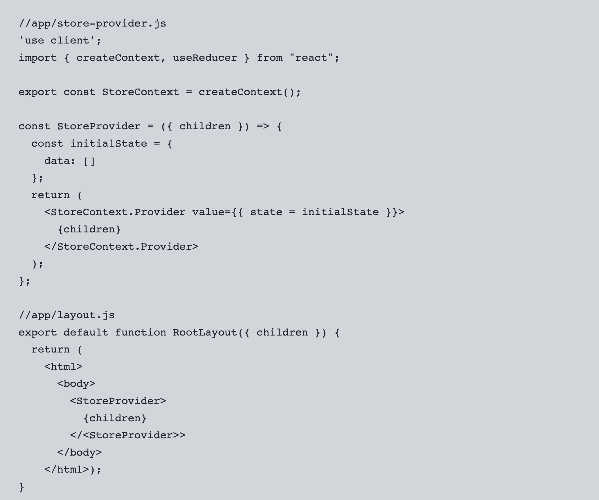

# 23.07.16(일)

## 오늘 한 일
1. Frontend 공부
2. [1주일 회고](../회고록/7월 3주차.md) 작성
3. Gloddy 개발

## 오늘 배운 내용
### 1. [Airbnb 스타일가이드 - React](https://github.com/apple77y/javascript/tree/master/react)
- 5년 전에 업데이트 된 거라, class컴포넌트와 함수형 컴포넌트의 혼합 등 약간 요즘 트렌드와 다른 부분이 있음.

### 2. [클린 코드(Clean Code) 핵심 요약 및 정리](https://mangkyu.tistory.com/132)
1. 함수는 하나의 역할만 해야한다.
2. 명령과 조회를 분리하라.
3. 오류코드보다는 예외를 활용하자.
   ```js
   if(result.error===ERROR_CODE){

   }
   ```
   위 코드 보다는
   ```js
   try{
      doSomething();
    }catch(e){
      if(e instanceof ERROR_CODE){
  
      }
   }
   ```
   위 코드를 지향


### 3. [React Server vs Client Component in Next.js 13](https://velog.io/@brgndy/React-Server-vs-Client-Component-in-Next.js-13-%ED%95%B4%EC%84%9D#%EB%A6%AC%EC%95%A1%ED%8A%B8-%EC%84%9C%EB%B2%84-%EC%BB%B4%ED%8F%AC%EB%84%8C%ED%8A%B8%EB%93%A4%EC%9D%80-%EB%AC%B4%EC%97%87%EC%9D%B8%EA%B0%80)
- Serialization(직렬화) : 객체가 파일 시스템, DB 또는 메모리에 저장 될 수 있도록 하기 위해서 객체를 바이트 스트림으로 변환하는 과정
- React Server Component : 서버에서 렌더되고 요청되는 컴포넌트
  1. onClick같은 상호작용성을 포함 X
  2. fallback과 함수들은 props들로써 전달될 수 없음
  3. 리액트 Life Cycle hooks 사용 X
  4. 백엔드 부분이라고 생각하기 시작하면 이해가 될 것
  5. DB, 파일 시스템에 기반한 작업들이나, Life Cycle hooks들이나 상호작용성이 없는 다른 컴포넌트들
  - RSC의 목적
    1. Client Side 번들을 포함 X
    2. 사용자가 적은 JS코드들을 다운로드할 수 있도록 함

- Client Component
  1. onClick같은 상호작용성 포함
  2. Client라고 불리는 브라우저에서 렌더됨
  3. `use client`라고 선언함으로써 그들이 client 컴포넌트인걸 나타냄

- Server Component vs Server Side Rendering
  1. Server Component는 HTML 자체를 반환하기보다는, 렌더된 UI에 대한 설명을 반환
     1. 이러한 방식은 리액트가 상태값을 잃지 않고 존재하는 Client Component와 데이터를 영리하게 병합할 수 있다.
     2. 브라우저의 stream은 더이상 JSON이 아니지만, JSON과 비슷한 이미지처럼 보임
     3. React Server Component들이 페이지에 컴포넌트들을 렌더하기 위해 다른 Stream type을 사용하기 때문
  2. RSC는 각각의 컴포넌트마다 Client 컴포넌트로 렌더할 것인지, Server 컴포넌트로 렌더할 것인지 선택 vs SSR은 페이지당, 해당 페이지 자체를 SSR 하도록 함
- Server Component에서 Client로 props전달하는 방법
  - Server Component들은 serializable(직렬화)가 되어야 함
  - props로써 () => {}같은 화살표 함수를 전달할 수 없음
  - 우리는 JSON으로 직렬화 될 수 있는 props들을 전달할 수 있음
- Client Component가 아니라 Server Component에서만 명백히 작동하도록 하게 하고 싶다면 `Server-only` 패키지 설치 가능
- Server Component 안에서 Client 함수를 사용하고 싶다면
  - Client 함수를 사용한 컴포넌트를 만들고, 그 사이에 children으로 넣어줌


## 고민한 점

## 추가로 학습할 것

## 오늘의 생각

