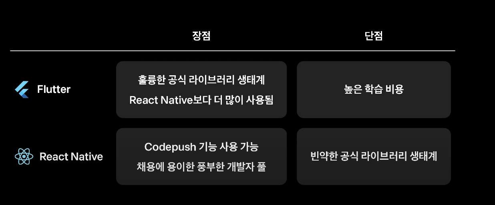
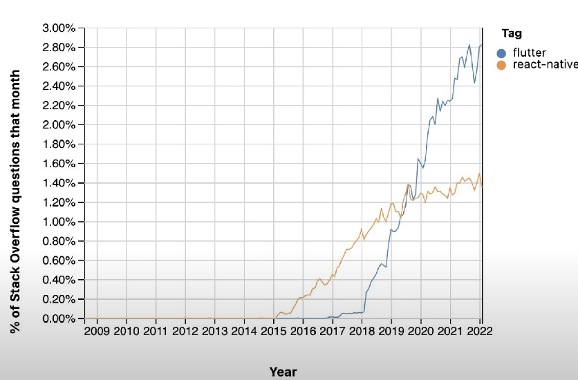

# 23.07.17(월)

## 하루 요약
1. 10시 ~ 12시 : Frontend 공부
2. 13시 ~ 21시 : Gloddy 개발 및 관련 공부
   1. [배포 안되는 이슈 해결](https://github.com/gloddy-dev/gloddy-client/pull/115)
   2. [tailwind 설정 코드 간결화](https://github.com/gloddy-dev/gloddy-client/pull/117)
   3. [framer-motion 라이브러리 이용한 페이지 이동 시 애니메이션 구현](https://github.com/gloddy-dev/gloddy-client/pull/118)
   4. [패키징에 사용할 프레임워크](https://github.com/gloddy-dev/gloddy-client/discussions/79)

## 오늘 배운 내용
### 1. Git 명령어(모르는 내용만 간추리기)
- `git status` : 파일 상태 확인
- `git branch` : branch 목록
- `git branch <브랜치 이름>` : branch 생성 
- `git checkout master` : master branch로 되돌아옴

### 2. CLI 명령어
1. `sudo` : 관리자만 읽을 수 있는 파일 읽기 / 새로운 프로그램 설치
2. `cd /` : 루트 디렉토리로 이동
3. `pwd` : 현재 full 디렉토리 확인
4. `touch [파일명]` : 빈 파일 생성
5. `mkdir [폴더명]` : 디렉토리 생성
6. `open .` : 현재 폴더를 macOS finder에서 보기
7. `code .` : 현재 폴더를 VSCode에서 보기

### 3. Slash 수강하기
### 4. [2022 상반기 프론트엔드 개발 취업 회고](https://velog.io/@hustle-dev/2022-%EC%83%81%EB%B0%98%EA%B8%B0-%ED%94%84%EB%A1%A0%ED%8A%B8%EC%97%94%EB%93%9C-%EA%B0%9C%EB%B0%9C-%EC%B7%A8%EC%97%85-%ED%9A%8C%EA%B3%A0#-%EC%98%A4%EB%8A%98%EC%9D%98%EC%A7%91)
- 글쓴이 : 16학번 > 21년 브투캠프 > 22년 네이버웹툰 취업
- 22년 1월~5월까지 25개 회사 지원 > 대부분 서류 불합격
  1. 계속 이력서와 포트폴리오 점검하며 수정, 부족한 부분 공부하며 지원
  2. 2~3월 몇몇 기업 서류 합격
- 기술 질문 : 내가 한프로젝트, JS,React,TS 등 학습해온 내용 정리
- 인성 질문 : `이 회사에 왜 들어오고 싶은지`, `자신이 그동안 무엇을 해왔는지`, `왜 그 길을 선택했는지`에 대한 정리가 잘 되어 있으면 수월하게 답할 수 있음

- 팁
  1. 자신감을 가지면서도 겸손해지자.
     1. 기술적인 부분에 대해 많이 공부했다고, 과한 자신감을 가지지 말고 항상 겸손해지자.
  2. 면접은 서로 의사소통하는 자리이다.
     1. 질문에 대답을 못하는 것이 크리티컬하지 않다.
     2. 여러 면접을 경험하면서 면접에 대한 긴장감이 점점 풀리고 그 자리를 내가 아는 다른 분들과 이야기하는 것처럼 즐기게 됨
     3. 서로 이사소통이 얼마나 잘 되는지가 더 중요하다.


### 5. [gmarket 디자인 시스템](https://gds.gmarket.co.kr/)

### 6. 웹뷰 패키징
- 야놀자 앱 : 모바일 애플리케이션. but 몇몇 화면은 웹뷰를 사용하여 하이브리드로 처리
  - 기존 야놀자 앱 : php + javascript(jQuery)를 통해 제작
  - 신규 야놀자 앱 : Typescript + Next.js + Mobx
    - Typescript : 코드 작성 시 코드 에러 검출
    - Next.js : 편리한 SSR + 초기 렌더링 구동 속도 보장
    - Mobx : 다수의 파일을 생성하는 일 줄이자
- 웹뷰의 장점
  1. AOS, IOS 각각 기능을 구현하기 보다 **웹 하나만 구현**하면 되기에 개발 자원이 크게 줄어든다.
  2. 배포함에 있어 스토어에서 심사를 받지 않고 **곧바로 업데이트**가 가능하다.

### 7. [토스 Slash : React Native](https://www.youtube.com/watch?app=desktop&v=b_6CjuvVg8o)

- 기존 구조의 문제점
  1. 느린 배포 속도
     1. 앱스토어 심사 시간 하루 ~ 1달
     2. 유저 업데이트 시간
  2. 개발 리소스 부족
- 방안 2가지
  1. 모두 웹으로 구성
     1. 항상 최신 기능 제공 가능
     2. 네트워크 환경 의존성
     3. 성능적인 한계
  2. cross Platform 프레임워크로 구현
    
    - Flutter가 뜨는 중
    
    - 하지만 높은 학습비용 존재
    - React Native는 Google의 Code Push를 통해 빠른 업데이트 가능
    - React 사용자가 많아 리소스 부족 문제 해결
    - 공식 라이브러리 생태계가 Flutter에 비해 빈약
- 부분 적용을 가능하게 하는 요소들
  1. 기존 프로젝트에 적용 가능
  2. 1React Native Bundle : N 진입점
  3. React Native와 Native간의 통신
  4. BUndle을 다운로드 받아 사용ㄱㄹ

- 부분적으로 적용했을 때 장점
  1. 점진적 적용 가능
  2. 기존 모듈 활용 가능
- 완전히 다시 작성했을 때 ✅
  1. 시간이 더 오래걸린다
  2. cross platform의 이점

- React Native 사용후기
  1. 저렴한 학습 비용
  2. 역할의 확장 
  3. 더 높은 복잡성 : 푸쉬 알림, 파일 읽고 쓰기 등
  4. 빠르게 실패와 개선 과정 반복 가능
  5. 채용이 어려운 초기 스타트업에 유용

### 8. [토스ㅣSLASH 23 - 달리는 토스 앱에 React Native 엔진 더하기](https://www.youtube.com/watch?v=6H9WQDRFZYg&t=1s)
- 토스의 첫 화면, 두 번째 탭인 `헤택 탭`, 네 번째 탭인 `주식 탭`은 RN기술을 사용 중
- 로딩 시간 : Web : 3.5s vs RN : 0.Xs
  - Web : HTML 다운로드 > JS 다운로드 > JS 실행
  - RN : JS 실행(미리 다운로드)

- RN도입과정에서 기술적 도전
  1. 서비스별 배포 : Shared + Service(서비스 별로 구분하여 배포)
  2. 빌드 속도 감축 : esbuild
  3. 8개 언어, 3개 플랫폼 : RN Test Page만들어서 테스트
  4. 의존성 관리 : Yarn Plug'n 'Play로 속도 감축

### 9. [Typescript 학습법](https://velog.io/@teo/typescript#%ED%83%80%EC%9E%85%EC%8A%A4%ED%81%AC%EB%A6%BD%ED%8A%B8-%ED%95%99%EC%8A%B5-%EB%A1%9C%EB%93%9C%EB%A7%B5)

1. 변수 선언과 함수 인자부터
2. 타입 선언보다는 가급적 자동추론을 사용하자
   1. 원시타입의 경우 너무 뻔해서 타입 지정을 생략해도 TS가 암묵적으로 타입을 지정한다.
3. 백엔드 스키마 interface를 만드는 것을 연습해보자
   ```js
   const getUser(id:string):Promise<User> {
      ...
    }
    ```
4. callback을 인자로 만드는 방법을 공부하자.
   ```js
   const getUser(id:string, callback: (user:User) => void):void {
      ...
    }
    ```

- TS 공식문서가 엄청 친절한 편이며 로드맵이 나쁘지 않지만, 워낙 양이 방대하다보니 공부할 엄두가 안날 것임. 공식문서는 빠르게 어떤 것이 있는지 훑어보고, JS에 AutoComplete + Type 검사용 플러그인이라는 생각으로 그 떄 그 떄 필요한 것만 찾아보며 접근하기

### 10. Portal
- Portal : ReactDOM에서 제공하는 컴포넌트를 렌더링할 떄, 부모 컴포넌트의 DOM 외부에 존재하는 DOM 노드에 렌더링할 수 있게 해줌
  - Modal 컴포넌트를 만들 때 유용
- [참고 프로젝트](https://github.com/depromeet/Ding-dong-fe/blob/main/src/components/Portal/Portal.tsx)
```js
'use client';

import { PropsWithChildren, useEffect, useRef } from 'react';
import { createPortal } from 'react-dom';

import useIsMounted from '~/hooks/useIsMounted.hooks';

export type PortalProps = {
  documentId?: string;
};

const findWrapperElement = (documentId: string): Element | null => {
  const wrapper = document.getElementById(documentId);
  if (wrapper) {
    return wrapper;
  } else {
    console.warn(`Element with ID '${documentId}'가 root layout에 없어요....추가해주세요.`);
    return null;
  }
};

export const Portal = ({ documentId, children }: PropsWithChildren<PortalProps>) => {
  const ref = useRef<Element | null>(null);
  const isMounted = useIsMounted();

  useEffect(() => {
    if (documentId) {
      const wrapper = findWrapperElement(documentId);
      ref.current = wrapper;
    } else {
      ref.current = findWrapperElement('portal');
    }
  }, [isMounted, documentId]);

  if (!(isMounted && ref.current)) return null;

  return createPortal(children, ref.current);
};

```
- 루트 layout에서 `<div id='portal'>`로 설정 > Portal 컴포넌트에서 `document.getElementById(documentId)`로 해당 요소를 찾음 > 컴포넌트가 mount되면(렌더링되면) > createPortal을 통해 해당 요소에 children을 렌더링

### 11. AnimatedPortal

```js
'use client';

import { AnimatePresence, motion, MotionProps } from 'framer-motion';
import { PropsWithChildren } from 'react';

import { Portal } from '~/components/Portal';

type AnimatedPortalProps = {
  motionProps: MotionProps;
} & PropsWithChildren;

export const AnimatedPortal = ({ children, motionProps }: AnimatedPortalProps) => {
  return (
    <Portal>
      <AnimatePresence>
        <motion.div {...motionProps}>{children}</motion.div>
      </AnimatePresence>
    </Portal>
  );
};

```
- 위에서 만든 Portal 컴포넌트와 `framer-motion`의 `AnimatePresence`컴포넌트로 감싸서 animation넣음

### 12. modal의 z-index
```js
zIndex: {
  toast: '1000',
  modal: '500',
  top1: '100',
  top2: '50',
  mid1: '25',
  mid2: '10',
  below: '-1',
},
```
modal의 z-index를 tailwind.config에서 따로 설정

## 누적 복습 (7.7 ~ 7.10)
1. CSR은 `<div>`빈태그로 받고, js 다운로드 후 js를 실행하며 서버로부터 채울 데이터를 받는다. 그래서 CSR방식은 초기 렌더링이 빠르다.
2. Redux는 Flux패턴으로, Action이 발생하면 Reducer가 이를 받아서 Store에 저장하고, store에 저장된 데이터를 view에 뿌려주는 방식이다.
3. dvh을 이용하여 모바일 화면에 맞게 높이 레이아웃을 설정할 수 있다.
4. CommonJS는 브라우저 뿐 아니라 다양한 환경(서버 사이드 애플리케이션, 데스크톱 애플리케이션 등)에서 JS를 사용하려고 만들어진 모듈 시스템으로, module.exports, require()로 모듈을 불러온다.
5. RSC는 Zero-bundle size, DB/파일시스템 접근 등이 가능하게 해준다.