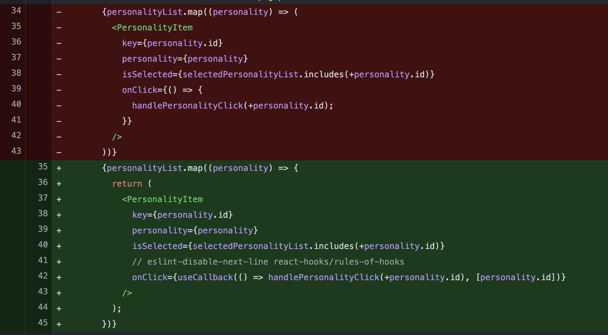
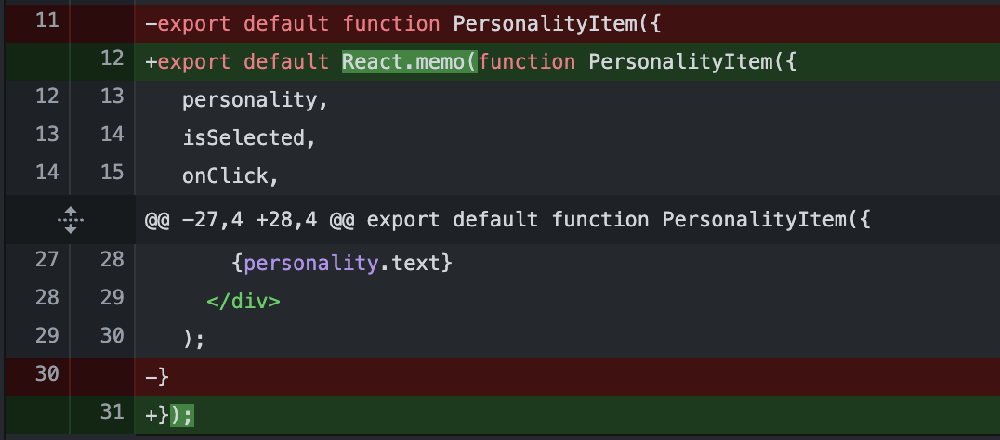

# 23.07.21(토)

## Today Summary
1. 10:00 ~ 12:00 : Gloddy 개발
2. 13:00 ~ 14:15 : 멘토링
3. 14:30 ~ 18:30 : 정리 및 Gloddy 개발
4. 21:00 ~ 23:00 : Frontend 공부
   1. React 렌더링 최적화
   2. 코드 분석 : usecallback, compound pattern
   3. 상태 관리 라이브러리를 사용하는 원칙

## Today I Worried
1. 렌더링 이슈

위와 같은 페이지가 있다. page.tsx > List.tsx > Item.tsx * n의 형태를 띄고 있다. 

구조를 어떻게 짜야 렌더링을 최소화 할 수 있을까?

우선, `완료` 버튼을 누르면 내가 누른 요소들의 상태를 서버에 전송해야 한다. 그렇기에 요소들의 상태를 선언은 버튼과 같은 depth에 있어야 한다. 버튼에는 setState, 각 Item에는 setState와 state를 넘겨주는 것이다.

그리고, 각 Item은 React.memo로 감싸야 한다. 왜냐하면, 한 요소의 상태가 바뀌면,그 부모 컴포넌트(List 컴포넌트)가 리렌더링이 일어나고, 그 자식들(Item 컴포넌트들) 또한 리렌더링이 일어나기 때문이다. 그러넫, 다른 Item들은 바뀐 것이 없기 때문에 리렌더링이 일어날 필요가 없다. 즉, 불필요한 리렌더링이다.

또한, Item에 넘겨주는 setState는 함수이기에 객체이다. 객체이기에 아무리 함수가 안바뀌어도 다른 것으로 인식하여 Item 컴포넌트는 리렌더링이 일어난다.  Item 컴포넌트에서는 `useCallback`을 사용하여, 함수의 불변성을 지켜야 한다.

- 변경된 코드

- 두 번째 사진에서 `useCallback`을 사용할 때 eslint의 react-hooks rule을 무시하는 방법을 사용했다. [`useCallback` 공식문서](https://react.dev/reference/react/useCallback#reference)에서는 `useCallback`을 컴포넌트의 최상단에서 선언하라고 쓰여있다. 그런데, PersonalityItem에 넘겨주는 props인 `onClick`함수를 넘길 때 `handlePersonality`함수의 인자로 `id`를 넘겨주어야한다. 이 `id`는 map함수에서 가져온 id값이여서 컴포넌트의 최상단에서 선언할 수가 없다. 최상단에서 선언된 `handlePersonality`함수를 useCallback을 통해 메모이제이션을 해도 props로 넘길 때 () => handlePersonality(id)로 무기명 함수로 또 선언되기에 메모이제이션한 것이 의미가 없어진다. 이것을 어떻게 해결해야 할 지 모르겠다. 오늘은 다른 프로젝트에서는 `useCallback`을 어떻게 활용했는 지 알아봐야겠따.

각각 `React.memo`, `useCallback`으로 메모이제이션을 하기 전과 후이다. 확연한 렌더링 차이가 있다. 작은 규모의 프로젝트에서는 크게 체감이 안될 수 있지만, 이러한 것들이 쌓이고 쌓이면 크나큰 성능차이를 불러일으킬 것이다.

## Today I Thought
