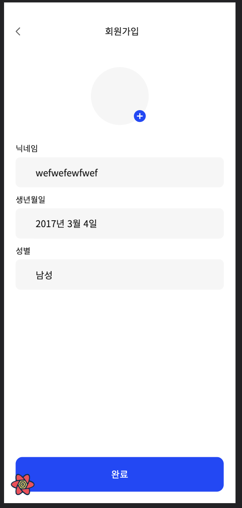

# 23.07.25(화)

## Today Summary
1. 12시 ~ 19시 : Gloddy 프로젝트
   1. 기존 page 라우팅 -> useFunnel 패턴으로 수정
   2. Frontend 공부 : [react-hook-form](../Memo/frontend/react-hook-form/react-hook-form.md)
2. 19시 30분 ~ 21시 30분 : DND 회의

## Today I Worried
### 1. Depth에 대한 고민
내가 맡은 회원가입 페이지.. 중구난방이다. 폴더 구조도, 상태관리도 재각각이다. 어쩌다가 이렇게 되었는지 모르겠다.

```js
// step1
<main>
  <AuthTitleTextMessage text={`휴대폰 번호를\n인증해주세요`} />
  <InputForm />
  <Spacing size={18} />
  <CheckboxSection />
</main>
// step2
<main>
  <AuthTitleTextMessage text={`재학중인 학교\n선택해주세요`} />
  <InputForm />
  <BottomModal />
</main>
// step3
<AuthTitleTextMessage text={`재학생 인증을 위해\n학교 이메일을 입력해주세요`} />
<InputForm />
<NoticeSection />
// step4
<main>
  <InputForm />
</main>
// step5
<main>
  <AuthTitleTextMessage text={`사용자님의 성격을\n선택해주세요!`} />
  <p className="text-14 text-gray2">3개를 선택해주세요.</p>
  <Spacing size={30} />
  <InputForm />
</main>
```
각 InputForm 컴포넌트는 현재 다른 난이도의 추상화를 가지고 있다.

어떤 난이도의 추상화로 구현을 해야 가장 best설계일까 ?

우선, `useFunnel`을 먼저 사용한 주혁님의 페이지 구조는 다음과 같다.

`Funnel` > `Funnel.step` > `페이지 컴포넌트` > `TopNavigationBar`, `메인 컴포넌트`, `FixedButton`

먼저 Funnel을 구현했으니, 내가 이 구조를 따라가는 것이 맞다고 생각한다. 이 구조 또한 좋은 구조라 생각한다.

그럼 어디까지가 server component이고, 어디까지가 client component이어야 할까? 우선, 페이지 컴포넌트까지는 server component이어야 한다. 왜냐하면, `페이지 컴포넌트`하위에 있는 `TopNavigationBar`의 경우 서버에서 렌더링하는 것이 맞기 때문이다.

그렇다면, 만약 `메인 컴포넌트`에 대한 상태값(예를 들어 인증 전, 인증 후)은 `메인 컴포넌트` 안에서 다루는 것이 맞다고 생각한다.

### 2. 컴포넌트 분리


위와 같은 페이지에서, 각 input들의 컴포넌트를 분리하는 것이 맞을까? 각 input을 분리하면, 각 input에 대한 로직들이 분리될 것이다. 이전 페이지들을 떠올려보면, 각 input들을 분리했다. 이 페이지 또한 각 input들을 분리하는 것이 맞다고 생각한다.

여기서 고민되는 부분이 한 input값을 변경하였을 때, 다른 input값도 변경된다는 사실이다. 이는 Context API를 사용하기 때문이다. 그렇다면, 이를 어떻게 해결해야 할까? react-hook-form은 비제어 컴포넌트로 관리를 해주는데 왜 이런 문제가 발생하는 것일까?

그렇다. react-hook-form은 비제어 컴포넌트로 관리를 해준다. `watch` 함수를 `react-hook-form`에서 가져오지 않는 한 말이다. 그래서, `watch`가 아닌, 필요할 때만 사용하는 `getValues`를 활용하면 입력할 때마다 다른 컴포넌트가 리렌더링이 일어나지 않는다.

항상 아무 생각 없이 `watch`를 사용했기에 이런 문제가 발생했던 것이다.

그렇다면, `watch`를 사용하여 값들이 `모두 채워지면 버튼이 활성화되는 로직`을 약간 변경해야한다. 예를들어, `마지막 요소를 선택했을 때` 이런 식으로 말이다.

### 3. Client Component와 Server Component
현재, `useFunnel`을 불러오는 `JoinFunnel` 컴포넌트는 훅을 사용하므로 당연히 client component이다. 그런데, `JoinFunnel` 컴포넌트는 `Funnel` 컴포넌트를 불러오고, `Funnel` 컴포넌트는 `Funnel.step` 컴포넌트를 불러온다. 그렇다면, `Funnel` 컴포넌트는 client component이고, `Funnel.step` 컴포넌트는 server component이다.

client component에서 import한 server component기에 `Funnel.step` 컴포넌트는 client component가 된다. 이를 server component로 사용할 수는 없을까?

`useFunnel`에 대해 다시 짚어 봐야 한다.

`useFunnel`은 클라이언트 측에서 컴포넌트를 교체하며 사용자들에게 다른 화면을 보여주는 훅이다. 그렇기에, client 컴포넌트로 구성되는 것이 당연한 것이다.

이러한, server에서 렌더링 가능한 부분도 client에서 구현을 하여 RSC의 장점을 못누린다는 점이 아쉽게 느껴진다.

이러한 점을 어떻게 개선할 수 있을까?