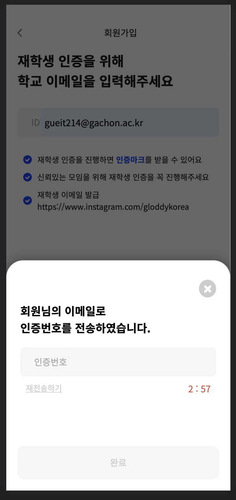

# 23.07.27(목)

## Today Summary
1. 10시 ~ 19시 : Gloddy 개발 
   1. PR 리뷰, 반영 ..
   - Form과 Section의 구분
     - form은 제출의 단위이다.
   - 컴포넌트 추상화 고민 -> 구조를 생각하고 추상화하기
2. Frontend 공부
   1. [React Query](https://github.com/ssi02014/react-query-tutorial#prefetching)
   2. [합성 컴포넌트](https://fe-developers.kakaoent.com/2022/220731-composition-component/)
   3. [낙관적 업데이트](https://github.com/TanStack/query/blob/main/examples/react/optimistic-updates-typescript/src/pages/index.tsx)


## Today I Worried
### 1. 파일 구조, 어떻게 해야 할까.
```js
<JoinTitleTextMessage>
  재학중인 학교
  <br />
  선택해주세요
</JoinTitleTextMessage>
<FormSection />
<SubmitSection />
```
현재 페이지 컴포넌트 구조이다. 현재 `FormSection`과 `SubmitSection`이 분리되어 있다. [주혁님이 지적](https://github.com/gloddy-dev/gloddy-client/pull/135#discussion_r1275201502)해준 것 처럼, submit제출은 form의 안에 있는 게 정상적이다. 나는 지금 표준적인 form의 형태를 벗어난 듯하다. 

하나의 폼(form)안에 여러 개의 input이 있고, 가장 하단에 button이 있는 것이 표준적인 form의 형태이다.

그렇다면, 컴포넌트를 어떻게 나누어야 할까?




이러한 경우, 하나의 폼일까, 두 개의 폼일까?

html은 `<form></form>`에서 가장 가까운 `<button></button>`을 찾아서 submit을 한다. 그렇다면, 위의 경우는 두 번 제출이 이루어지므로 두 개의 폼이라고 볼 수 있다. 맞다. 폼은 `제출`의 단위이다. 그렇다면, `제출`을 기준으로 컴포넌트를 나누어보자.

`FormSection`이라는 네이밍도 부적절하다. Form이면 Form이지, FormSection은 뭐람. -> 기존에 사용하던 `InputForm`으로 변경하였다. input들로 구성된 form이라는 의미이다. 

네이밍은 항상 고민이다. 다른 프로젝트들은 네이밍을 어떤 방식으로 하고 있을까?

## Today I Thought
PR을 가볍게 하는 것의 중요성을 또 한 번 느꼈다. PR이 무거우니, 마치 무거운 짐을 머리 위에 이고 있는 기분이다. 나 뿐 아니라 팀원에게도 민폐다 민폐..

앞으로 PR을 가볍게, 꼭 작은 단위로 일을 쪼개도록 하자. 일을 크게 벌리니 실수만 늘고, 시간이 지연만 된다.


