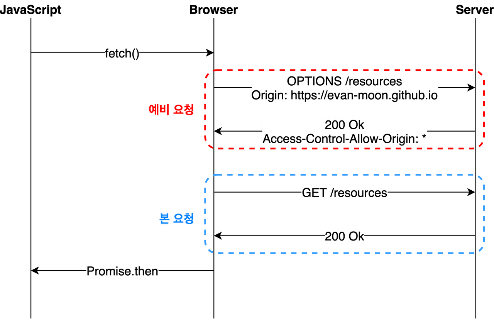
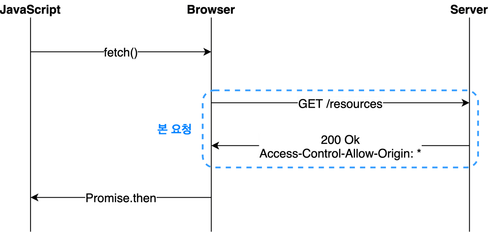

# 7.13(목)

## 하루 요약
1. ~18시 : 카공
2. 19시 ~ 22시 : Gloddy 워크숍
## 오늘 한 일
1. Gloddy 개발
2. Gloddy 워크숍

## 오늘 배운 내용
### 1. CORS
- CORS란?
  - Cross Origin Resource Sharing, 교차 출처 리소스 공유
  - 다른 출처의 리소스를 공유하는 것을 허용하는 메커니즘
  - 출처(Origin) : Protocol + Host + Path
  - e.g. http://localhost:3000
- SOP란?
  - Same Origin Policy, 동일 출처 정책
  - 다른 출처의 어플리케이션이 서로 통신하는 것에 대해 아무런 제약이 없다면, 악의를 가진 사용자가 소스 코드를 쓱 구경한 후 CSRF(Cross-Site Request Forgery)나 XSS(Cross-Site Scripting)와 같은 방법을 사용하여 사용자의 정보를 탈취하기가 너무 쉬워짐
  - 브라우저의 구현 스펙에 포함되는 정책이기에 서버 간 통신을 할 때는 이 정책이 적용되지 않음

- CORS는 어떻게 동작하나요?
  1. 브라우저는 요청 헤더에 `Origin`이라는 필드에 요청을 보내는 출처를 함께 담아보냄
  2. 이후 서버가 응답을 할 때 응답 헤더의 `Access-Control-Allow-Origin`이라는 값에 "이 리소스를 접근하는 것이 허용된 출처"를 내려주고, 이후 응답을 받은 브라우저는 자신이 보냈던 응답의 `Access-Control-Allow-Origin`과 일치하는지 확인 후 유효한 응답인지 결정

- Preflight Request
  - Preflight : 브라우저가 본 요청을 보내기 전에 보내는 예비 요청
  - HTTP 메소드 중 `Options`메소드 사용
  1. 서버에게 Preflight 요청을 보냄 
  2. 서버는 응답 헤더에 `Access-Control-Allow-Methods`라는 헤더를 담아서 보냄
     - 현재 자신이 어떤 것을 허용하고, 금지하는 지에 대한 정보를 담음
     - Preflight Request에 대한 응답에서 에러가 발생하지 않고 200이 떨어질 수 있음. CORS정책 위반으로 인한 에러는 예비 요청의 성공 여부와 별 상관이 없음
  3. 자신이 보낸 Preflight 요청과 서버가 응답에 담아준 허용 정책을 비교한 후, 이 요청을 보내는 것이 안전하다고 판단된다면 엔드포인트로 다시 본 요청을 보내게 됨


- Simple Request
  - Preflight Request를 보내지 않고 본 요청부터 때려박은 후, 서버가 이에 대한 응답의 헤더에 `Access-Control-Allow-Origin`을 담아서 보내주면 그 때 브라우저가 CORS 정책 위반 여부를 검사하는 방식
  - 이 조건이 조금 더 까다로움



### 2. credentialed Request
- `XMLHttpRequest` 객체나 `fetch` API는 별도의 옵션 없이 브라우저의 쿠키 정보나 인증과 관련된 헤더를 함부로 요청에 담지 않음
- 이러한 정보를 담을 수 있는 옵션이 `credentials` 옵션
1. same-origin : 간은 출처 간 요청에만 인증 정보를 담을 수 있다.
2. include : 모든  요청에 인증 정보를 담을 수 있다.
3. omit : 모든 요청에 인증 정보를 담지 않는다.

### 3. clsx
- [clsx](https://github.com/lukeed/clsx) : 조건에 다라 `className` string을 조합해주는 라이브러리
```js
import React from "react";
import clsx from "clsx";

function RobynZzang(props) {
	const className = clsx({"title": props.really});
  	return <h1 className={className}>Very Zzang Zzang</h1>
}

const element = <RobynZzang really={true}/>

```
- props를 받아서 이에 따라 렌더링하는 경우
- 긴 if 조건문을 작성하지 않아도 됨

### Reference
- [CORS](https://evan-moon.github.io/2020/05/21/about-cors/)

## 추가로 학습할 것
- credentialed Request

## 고민한 것
1. clsx()를 사용하는 이유
   - 긴 if문을 작성하지 않아도 되서 편리함
2. tailwind css는 뒤에 클래스명을 선언한다고 해서 덮여 씌어지지 않는다 => `tailwind-merge` 라이브러리 사용으로 해결할 수 있음
3. tailwindcss가 적용이 안됨