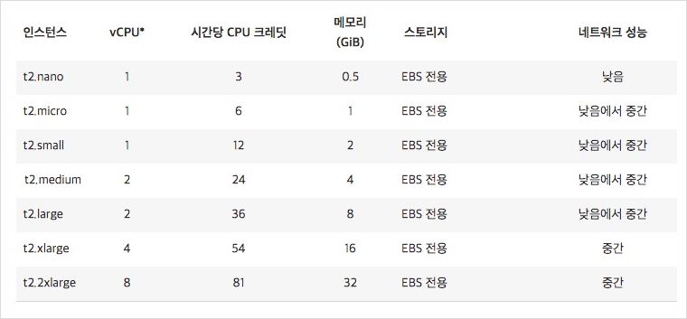
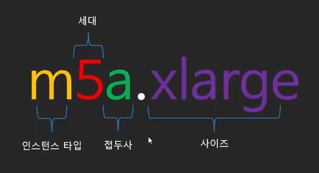

# EC2 배포
## EC2란?
- 아마존 웹 서비스(AWS)에서 제공하는 클라우드 컴퓨팅 서비스
- Ec2를 사용해 가상 서버를 구축하고, 보안 및 네트워킹을 구성해 보다 빠르게 애플리케이션을 개발하고 배포할 수 있음
- 인스턴스 유형, 운영체제, 소프트웨어 패키지 등을 선택할 수 있으며, 메모리, CPU, 스토리지, 부팅 파티션 크기 등을 선택할 수 있는 유연한 클라우드 호스팅 서비스
- 복잡한 공유기 세팅없이 인터ㅅ을 통해서 자롭게 접속할 수 있고, 이미지(AMI) 기능도 사용 가능
  - 이미지(AMI) : OS상태 그대로 저장하는 기능. 

### EC2 특징
1. 컴퓨팅 요구사항의 변화에 따라 컴퓨팅 파워 조절 가능
2. 실제로 사용한 용량 만큼만 지불
3. Linux/Windows 중 OS 선택 가능
4. 몇 분이면 전세계에 컴퓨터 수백여대를 생성
5. 머신러닝, 웹서버, 게임서버, 이미지 처리 등 다양한 용도에 최적화된 서버를 쉽게 구성 가능
6. 여러 다른 AWS 서비스와의 유기적인 연동이 가능

## EC2 구성
### 1. 인스턴스(컴퓨팅)
- 인스턴스 = AWS 클라우드에서 사용하는 가상 컴퓨터
  - 사용 사례에 맞게 최적화된 다양한 인스턴스 유형 제공
- 사용 목적(서버용, 머신러닝용, 게임용)에 따라 타입별로 인스턴스에 이름을 부여하여 구분
- EC2 인스턴스 사이즈
  - 인스턴스 cpu 개수, 메모리 크기, 성능 등으로 사이즈가 결정

- nano < micro < small < medium < large < xlarge < 2xlarge

### 2. EBS(하드디스크)
- EBS(Elastic Block Storage) : 데이터를 저장하는 역할
  - 클라우드의 가상 하드디스크
  - AWS 클라우드의 Amazon EC2 인스턴스에 사용할 영구 블록 스토리지 볼륨 제공

### 3. ENI(랜카드)
- AMI(Amazon Machine Image) : 인스턴스를 실행하기 위한 정보를 모은 단위
  - 세팅 정보(템플릿)를 저장한 단위

# Refernce
- [inpa](https://inpa.tistory.com/entry/AWS-%F0%9F%93%9A-EC2-%EA%B0%9C%EB%85%90-%EC%82%AC%EC%9A%A9-%EA%B5%AC%EC%B6%95-%EC%84%B8%ED%8C%85-%F0%9F%92%AF-%EC%A0%95%EB%A6%AC-%EC%9D%B8%EC%8A%A4%ED%84%B4%EC%8A%A4-EBS-AMI)