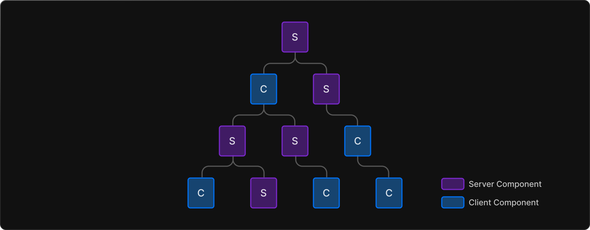
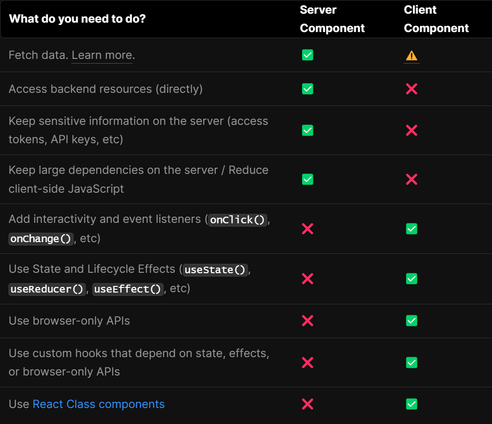

# React Server Component

- Next.js 13버전부터는 기본적으로 app directory는 Server component를 사용 -> 서버에서 컴포넌트를 쉽게 렌더링하고 클라이언트로 전송되는 JS양을 줄일 수 있음
- Server Component와 Client Component를 interleave하는 방법
  1. Server Component 안에서 Client Component를 import해서 사용
  2. Client Component의 child나 props로 Server Component를 전달


### 성능을 향상 시키고 싶다면?
- Client Component를 Component Tree의 맨 아래쪽에 오도록 이동시키는 것이 좋다.

### Why Server Component?
- RSC(React Server Component)를 사용하면 개발자가 서버 인프라를 더 잘 활용할 수 있게 됨
  - 클라이언트의 JS번들 크기에 영향을 미쳤던 large dependenices가 서버에 대신 남아 성능을 향상
  - initial page load가 빨라짐
  - Base client-side runtime은 캐시가 가능하고, 크기가 예측 가능하며, 애플리케이션이 커져도 증가 X

### Client Component
- 애플리케이션의 client-side interactivity를 추가할 수 있음
- Next.js의 경우 서버에서 prerendering되고 client에서 hydrate
- 이 방식은 Next.js 12및 이전 버전에서 작동한 방식
- `'use client'`를 최상단에 작성

### Server Component vs Client Component 사용 시기



### 1. Client Component의 child나 props로 Server Component를 전달

- Client Component에서 Server Component를 import해서 사용은 불가
```js
// ✅ This pattern works. You can pass a Server Component
// as a child or prop of a Client Component.
import ClientComponent from "./ClientComponent";
import ServerComponent from "./ServerComponent";

// Pages are Server Components by default
export default function Page() {
  return (
    <ClientComponent>
      <ServerComponent />
    </ClientComponent>
  );
}
```
- React는 결과를 Client에 보내기 전에서 서버에서 Client Component를 우선 렌더링


### 2. Server Component 안에서 Client Component를 import해서 사용(Serialization, 직렬화)
- Serialization : Object 또는 data structure가 네트워크 또는 스토리지를 통한 전송에 적합한 방식으로 변환되는 프로세스


### Third-party packages
- npm packages에 있는 client 전용 기능을 사용하는 많은 컴포넌트들은 아직까지 `use client`지시문이 없음. 이것들을 Server component로 동작하는 곳에다가 import해서 사용한다면 제대로 작동하지 않고 오류를 일으킴. 이를 해결할 수 있는 방법은 `client component`를 따로 만들어서 import한 다음 그걸 다시 export 시켜주는 것

```js
'use client';

import { AcmeCarousel } from 'acme-carousel';

export default AcmeCarousel;
```