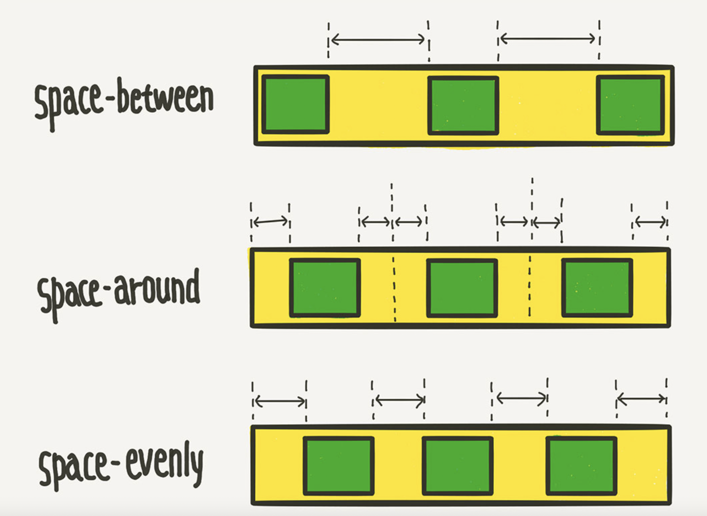
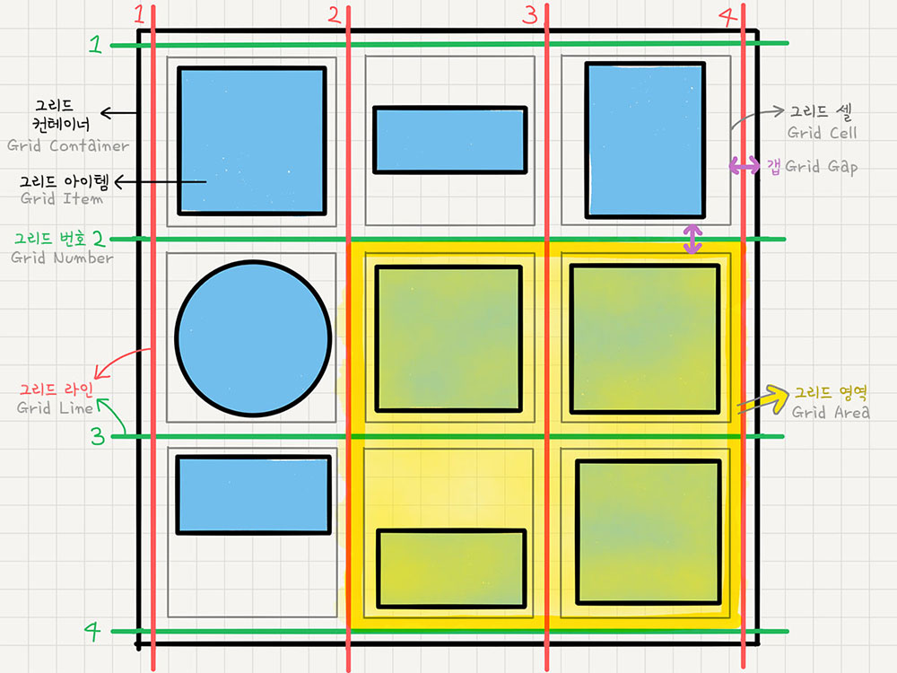

# CSS
### 1. 반응형 직사각형
```css
.box::after {
  display: block;
  content: "";
  padding-bottom: 100%;
}
```
- tailwind로 구현한다면?
```js
 <div className="before:block before:pb-[100%]">
 ```


 ## 2. scroll-snap-stop
- scroll을 움직였을 때 처음 부분에 맞춰서 스크롤을 멈출 지, 중간에서 멈출 지, 끝에서 멈출 지 설정할 수 있다.
```css
.snaps {
  overflow-x: scroll;
  scroll-snap-type: x mandatory;
  overscroll-behavior-x: contain;
}
.snap-target {
  scroll-snap-align: center;
}

.snap-force-stop {
  scroll-snap-stop: falways;
}
```
- Grid pile : 포갤 수 있음

## flex vs grid
### flex : 1차원
- `display`
  - flex : block 특성의 컨테이너를 정의 (수직 쌓임)
  - inline-block : inline 특성의 컨테이너를 정의 (수평 쌓임)
- `flex-direction`
  - row, row-reverse, column, column-reverse
- `flex-wrap`
  - nowrap : 기본 설정, 다음 줄로 넘어가지 않음. item의 너비를 줄여서 한 줄에 모두 배치
  - wrap : flex 요소가 여유 공간이 없다면 다음 줄로 넘어가서 배치
  - wrap-reverse : flex 요소가 여유 공간이 없다면 다음 줄로 넘어가서 배치. 단, 아래쪽이 아닌 위족으로 넘어감
- `align-items`(수직 정렬)
  - stretch : 기본 설정, flex item의 높이가 flex container의 높이와 같아짐
  - flex-start : flex 요소는 flex 컨테이너의 위쪽에 배치
  - flex-end : flex 요소는 flex 컨테이너의 아래쪽에 배치
  - center : flex 요소는 flex 컨테이너의 가운데에 배치
  - baseline : flex 요소는 flex 컨테이너의 기준선에 배치
- `justify-content`
  - stretch : 기본 설정, flex 라인의 높이가 남은 공간을 전부 차지
  - flex-start : flex 라인을 flex 컨테이너의 앞 쪽에 배치
  - flex : end : flex 라인을 flex 컨테이너의 뒷 쪽에 배치
  - center : flex 라인을 flex 컨테이너의 가운데에 배치
  - space-between : flex 라인을 flex 컨테이너에 고르게 배치  
  - space-around : flex 라인을 flex 컨테이너에 고르게 배치하되, flex 라인의 양쪽에 동일한 공간을 추가

- `align-self`
  - align-items보다 우선 적용되며, flex 요소마다 서로 다른 align 속성값 설정 가능

### grid : 2차원
- 카드형식으로 되어 있는 신문형식의 레이아웃을 쉽게 만들고 여백을 쉽게 조절
- `display:grid;`

- grid container : grid의 전체 영역
- grid item : grid 컨테이너의 자식 요소들
- grid track : grid의 행과 열
- grid cell : grid의 한 칸
- grid line : grid의 가로선과 세로선
- grid number : grid의 행과 열의 번호
- grid gap : grid의 각 셀 사이의 간격
- grid area : grid의 영역

1. `grid-template-columns` : grid 트랙의 크기를 지정
```css
.container {
	grid-template-columns: 200px 200px 500px; /* 열(column)의 배치 */
	grid-template-columns: 1fr 1fr 1fr  /* 1:1:1 비율 */
	grid-template-columns: repeat(3, 1fr) /* 1:1:1 비율 */
	grid-template-columns: 200px 1fr /* 200px : 나머지 비율 */
	grid-template-columns: 100px 200px auto /* 100px : 200px : 나머지 */

	grid-template-rows: 200px 200px 500px;    /* 행(row)의 배치 */
	/* grid-template-rows: 1fr 1fr 1fr */
	/* grid-template-rows: repeat(3, 1fr) */
	/* grid-template-rows: 200px 1fr */
	/* grid-template-rows: 100px 200px auto */
}
```
- fr : fraction 숫자 비율대로 트랙의 크기를 나눔
- `minmax(100px,auto)` : 최소 100px ~ 최대 자동으로 늘어나게


- [Reference](https://studiomeal.com/archives/533)