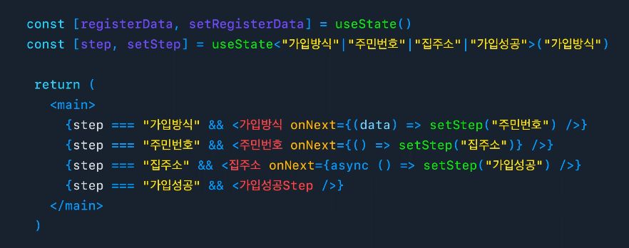

# 전역 상태 관리 Library

## Context API가 아니라, 서드 파티 라이브러리를 사용하는 이유
- `Context.Provider`는 value로 저장된 값이 변경되면 `useContext(Context)`를 사용하는 컴포넌트도 같이 렌더링 함 -> 불필요한 렌더링 발생
- 컨텍스트를 추가할 때마다 Provider로 매번 감싸줘야 하기에 `Provider hell`야기할 수 있음

## 퍼널 패턴
### 대표적인 프론트엔드 패턴
1. 상점 (목록 페이지 > 상세 페이지)
2. 단일 페이지 앱
3. 설문 조사(여러 페이지를 통해 상태 수집) -> 퍼널 패턴

### 퍼널 패턴에서의 상태 관리
1. 전역 상태 관리 : 각 페이지를 넘어갈 때, 전역으로 상태를 관리
   - 아쉬운 점 1 : 페이지 흐름이 흩어져 있다. 
   - 아쉬운 점 2 : 한가지 목적을 위한 상태가 흩어져 있다. 상태를 사용하는 곳은 한 곳인데, 수집하는 곳은 여러 페이지이다. 
2. step에 따라 조건부 렌더링

   - UI 세부사항은 하위 컴포넌트에서 관리하되, step의 이동은 상위에서 관리해 UI의 흐름을 한 군데서 관리할 수 있게 됨
   - `router`의 shallow push API를 활용해 query parameter를 업데이트하여 스텝 사이에 뒤로가기, 앞으로가기 지원
   - slash의 `useFunnel`


## useMemo를 사용하여 Context API의 리렌더링 이슈 해결
- Context API의 단점 : Context.Provider의 value가 변경되면, 해당 Context를 사용하는 모든 컴포넌트가 리렌더링 됨
- 해결 방법 : `useMemo hook`을 사용하여 불필요한 리렌더링 방지
```js
import React, { createContext } from 'react';

// initial state
const initialState = {
  ...
};

// create context
export const GlobalContext = createContext(initialState);

...

// useMemo 사용
const value = React.useMemo(() => ({ 
  watchlist: { ... }, // object 데이터
  addMovieToWatchlist, // 함수
}), [watchlist, addMovieToWatchlist]);

// provider components
export const GlobalProvider = (props) => {
  return (
    <GlobalContext.Provider value={ value }>
      {props.children}
    </GlobalContext.Provider>
  )
}
```

## 전역 상태란?
- 전역 : 문서의 어떤 곳에서도 접근할 수 있는 영역
  - 전역으로 존재한다  : 컴포넌트 뿐 아니라 컴포넌트 외부, 애플리케이션 코드 어디에서든지 접근 가능함
- 전역 상태 : 애플리케이션을 구성하고 있는 코드 어디세이서든지 접근이 가능하며, 변화에 따라 렌더링에 영향을 줘야하는 값
- 프론트엔드 애플리케이션 상태
  1. 외부에서 주입되는 동적인 데이터 (e.g. Server Response)
  2. 애플리케이션 UI 상태(e.g. isOpen)
  - 위 두 가지는 전역 상태와 어울리지 않는다. 
- 전역 상태로 관리해야 하는 것들
  1. 테마
     1. 로그인 정보테마에 따라 다른 색상으로 보여줘야 한다면 그 `테마`라는 값은 모든 컴포넌트에 영향을 줘야하고 컴포넌트들은 테마가 달라질 경우 다시 렌더링 되어야 할 것이다.
  2. 다국어 처리


# Reference
1. [https://velog.io/@yrnana](https://velog.io/@yrnana/Context-API%EA%B0%80-%EC%A1%B4%EC%9E%AC%ED%95%98%EC%A7%80%EB%A7%8C-%EC%97%AC%EC%A0%84%ED%9E%88-%EC%82%AC%EB%9E%8C%EB%93%A4%EC%9D%B4-redux%EC%99%80-%EC%A0%84%EC%97%AD-%EC%83%81%ED%83%9C%EA%B4%80%EB%A6%AC-%EB%9D%BC%EC%9D%B4%EB%B8%8C%EB%9F%AC%EB%A6%AC%EB%A5%BC-%EC%93%B0%EB%8A%94-%EC%9D%B4%EC%9C%A0)
2. [Toss Slash](https://www.youtube.com/watch?v=NwLWX2RNVcw&t=113s)
3. [https://jbee.io/react/thinking-about-global-state/](https://jbee.io/react/thinking-about-global-state/)