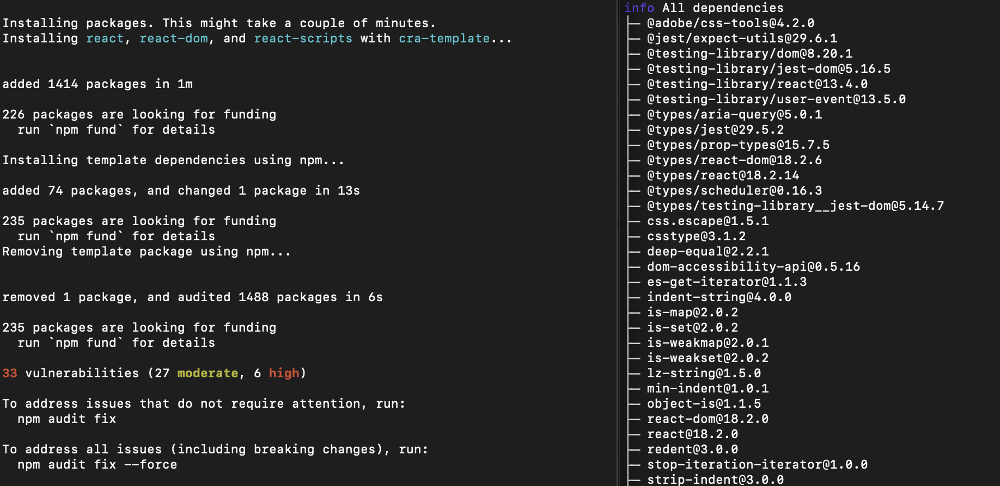

# yarn
### npm이 뭐야?
- npm : node.js의 패키지를 관리해주는 툴
### yarn이 뭐야?
- yarn은 npm의 단점을 보완하기 위해 페이스북에서 개발한 또다른 패키지 매니저

### yarn이 npm보다 좋은 점
1. npm은 버전이 일관적이지 않다.
   1. npm : Symantic Versioning 앞에 캐럿 기호(^)npm install을 사용하면 해당 major 버전 내에서 최신 버전을 다운로드 -> 모듈 간의 버전 불일치 문제가 발생할 수 있음
   2. yarn : yarn.lock이라는 파일에서 버전을 관리 -> 버전 일관성 보장

2. yarn은 설치 속도가 빠르다
   1. yarn은 패키지를 설치할 때 병렬 다운로드 지원
   2. yarn은 캐시를 사용
   3. 그에 반해 npm은 모듈 이름을 사전 순서대로 정렬한 다음 순차적으로 설치
3. npm에 비해 yarn은 로그가 깔끔하다.
   1. 
   2. npm(좌), yarn(우)

### 마무리
- npm도 버전 업데이트되며 여러 가지 문제점이 개선
  - `package-lock.json` 파일이 추가되어 버전 일관성을 보장
  - 속도 또한 yarn과 큰 차이가 없는 수준까지 따라옴
  - npm이 사용자 수가 매우 많다는 점 또한 무시 못함

----
# 호기심 공부
### 버전(Symantic Versioning)
- Major.Minor.Patch
1. Major : 기존 버전과 호환되지 않는 변경사항
2. Minor : 기존 버전과 호환되는 변경사항(기능 추가)
3. Patch : 기존 버전과 호환되는 변경사항(버그 수정)