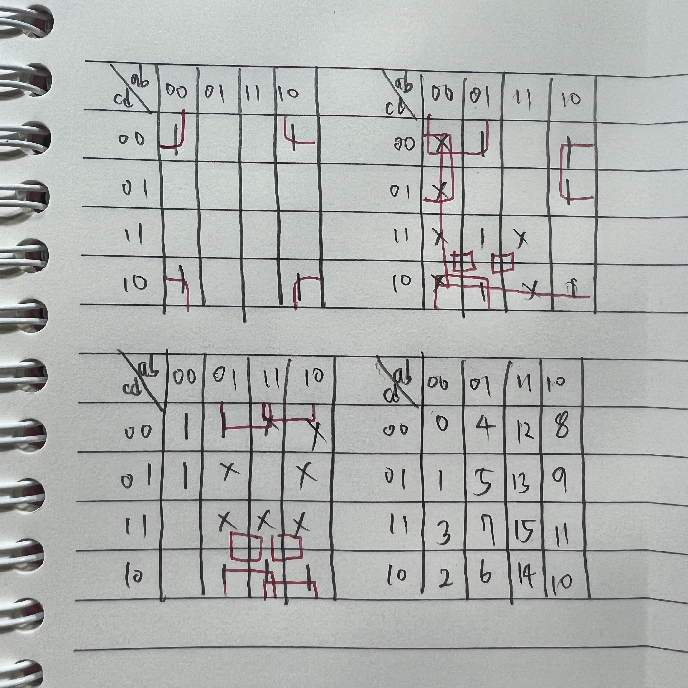

# 디회개

## digital system

### BCD

BCD코드는 4bit로 이루어진다. 일반적인 8421BCD사용 시, 9를 초과하면 6(0110)울 더해줘 다음 자리로 넘긴다
Inverter의 cost = 2

conversion(13 to 1101) != coding(13 to 0001|0011)

### Hamming Code

7비트 기준, 4개의 data bit, 3개의 check bit로 이루어져 1bit의 오류가 발생시 검출할 수 있다(2 bit이상 불가능)

n개의 check bit에 따라 2^n - n - 1 만큼의 data bit를 가질 수 있다

check bit의 위치는 2의 제곱승(1,2,4)체크 비트는 357, 367, 567이다   

검출 시 자기 자신까지 포함해서 e_n 측정, 4e_4 + 2e_2 + e_1 자리에서 오류가 났음을 확인한다

## combinational system

Driver = Inverter + Inverter

NOR, NAND, NXOR에 Inverter를 부텨 OR, AND, XOR가 만들어진다. 시간cost 역시 각각 +2가 된다.

Inverter = 2, NAND, NOR = 4, XNOR = 12

0+a = a, 1\*a = a Identity

1+a = 1, 0\*a = 0 Null

a+a = a, a\*a = a Idempotency

a+bc = (a+b)(a+c) distributive

a+ab = a absorption

드모르간 정의 하는 방법은 a + a' = 1, a*a' = 0 임을 증명

:::note

a+a'b = a+b simplication

(a+b)(a+b')=a adjacency

ab+a'c = (a+c)(a'+b)

:::

찾은 몇개의 패턴들   
- 하나만 다르면 complement 소거
- 두개 다르면 특별히 할 거 없음
- 3개, 2개 있을때 하나가 같다면 소거가능(다른 놈 소거)
- 4개 짜리 감는 법: 둘로 묶든 하나로 묶든, 그 이후 ab+a'c = (a+c)(a'+b)를 사용해 한번 더 분리 해야함   
  ab(c+d)꼴이나 c(a+b)(d+e)꼴은 안됨(3-input AND는 해결할 수 없음). 중요포인트: 2개 항만으로는 해결 불가능
  3항 묶기스킬도 존재

### Karnaugh Map

letter는 상수혹은 변수, literal은 보수까지 포함

Product term과 Sum term은 literal로 구성되나 letter가 중복될 순 없다

Minterm, Maxterm은 모든 letter가 사용되어야한다

모든 표현식은 Minterm으로 표현할 수 있다.(by complement)

Minterm들을 통해 카르노맵을 그린다

카르노맵에서 1들을 모아 minimum SOP를 만들 수 있다

minimum SOP 는 AND-OR 형식이다. Bubble pushing을 통해 NAND-NAND 게이트로 변환가능하다

카르노맵에서 0들을 모아 SOP 를 만들 수 있다

이때 구한 SOP는 F'으로, 드모르간을 취해주면 F를 구할 수 있고 이는 minimum POS이다

이들을 Maxterm이고, OR-AND gate이다. Bubble pushing을 통해 NOR-NOR게이트로 변환한다

Implicant : 2^k의 묶음

Prime-Implicant : Implicant중 가장 큰 묶음

Essential-PI : PI로 묶었을때 구성하는 요소 중 적어도 하나는 다른 PI에 속하지 않는 요소를 가지고 있는 PI

카르노맵은 EPI+일부PI의 모음이다

don't care : 0으로 봐도되고 1로 봐도되는 항. 있을때 카르노맵의 solution이 다양해진다

:::note

꼭지점, X가 포함되었을때 위아래 시야 넓게 가지기

don't care와 같이 묶을 때 solution들의 literal의 총합은 같다

input으로 보수가 허용된다면, a+b는 (a'b')'인 NAND게이트가 된다

4변수함수는 큐브모양으로 이루어질 수 있다. 2D space의 확장방법은 두 2D공간의 꼭지점을 잇는것, 3D to 4D 역시 마찬가지다

:::

## designing combinational system

full adder

S = A^B  
C_out = C_in(A^B)+A&B

ripple carry adder의 딜레이는 2n+4이다 => 시간복잡도 O(n)= linear하다

carry look ahead adder(CLA) carry를 미리 예측한다

:::note

연산시 C, X, Y, P, G는 같은레벨에서 시작이다   
carry generater(G) = A&B  
carry propogate(P) = A^B  
C_i+1 = C_i&P_i+G_i

4bit씩 묶여있을때, P,G를 계산하는데 1delay(이하 gate delay를 의미),  
C(i,i+3)계산하는데 2delay,  
S 계산하는데 1delay걸린다

S_9를 구한다면, 1+2+2+2(C9를 구해야함)+1 = 8

2-level CLA

1-level이 C0=>C4=>C8=>C12... 순차적으로 구하는거라면  
2-level은 C0을 통해 C4,C8,C12,...을 원콤에 구한다

대신 G(i,i+3)를 계산해야 C_i를 구할 수 있으므로 2delay가 추가필요하다

S_9든, S_6이든 1+2+2+2(C_i를 통해 C(i+1,i+3)을 구함)+1이 걸린다

:::

subtracter   
따로 subtracter를 구현 할 수도 있지만, 보수법을 이용하여 해결한다   
1과 xor연산을 하면 1의 보수가 처리된다는 것과 거기에 1이 더해지면 2의 보수가 된다는 것을 생각하여   
C_0를 1로 설정하고,  X_0과 Y_0을 연산할 때 넣어주고 C_0을 마스크로 xor 연산을 시키면 adder/subtracter를 동시에 해결하는 게이트가 완성된다   
