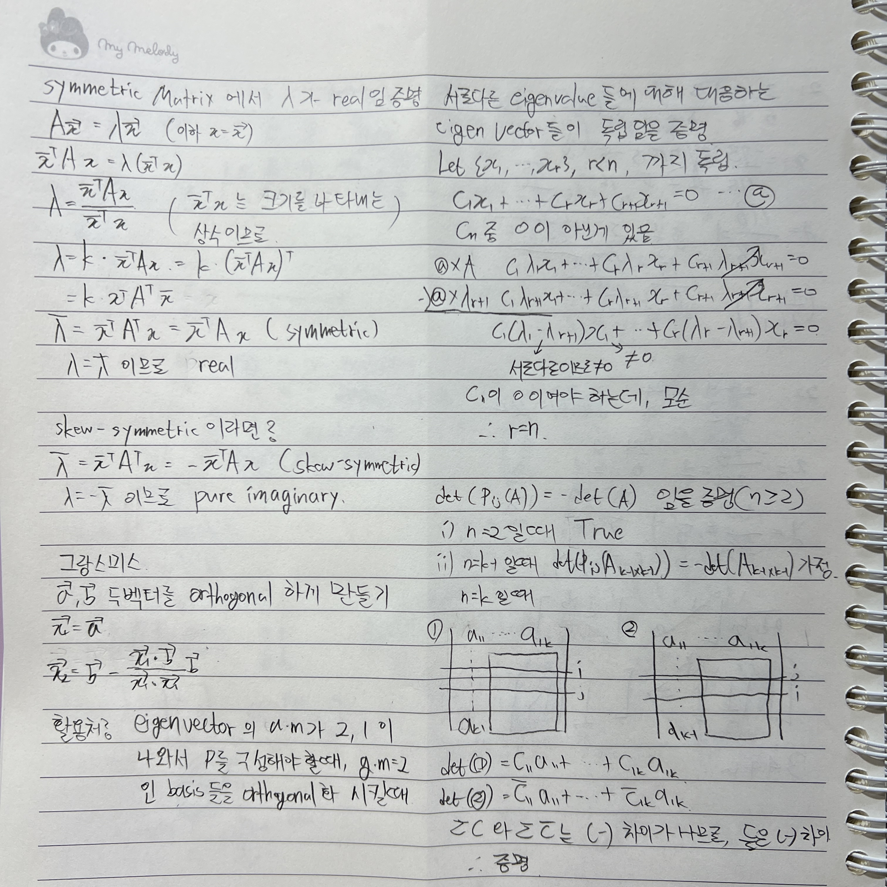

뭘 증명하려는 거지? => 뭘로 증명을 하지?  
알고있는 Definition, Theroem을 이용힌다

두 벡터만 있다면, 2차원 공간이든 n차원 공간이든 실수배로 종속/독립 판단

dim(0 vector space)=0

nullity = dim(N(A)) = # of free variable = n - r

r < m & (d_r+1 != 0) => no solution

r = m | (r < m & 이하 0행 ) => has solution  
그 중 r = n 이라면 unique solution

subset이 vector space의 subspace임을 증명하기 위해선 요소 두개를 뽑고, A+kB 꼴로 대입, 다시 A와 k(B)꼴로 묶어 그대로 성립함을 증명  
nonhomogeneous case의 해집합은 no solution(vector space X)이다  
homoheneous case의 해집합은 000만 가지거나, 무수히 많거나

2차원에서 한 쪽 공간만 포함하거나, positive 혹은 negative만 포함하는 subset이라면 실수배를 취하면 subset을 벗어나므로 subspace가 될 수 없다

cofacter의 갯수는 2n이고, cofacter Matrix는 부호를 포함한다

symmetric Matrix의 eigenvalue는 real(실수)  
skew-symmetric Matrix의 eigenvalue는 pure imaginary(순 허수)  
orthogonal Matrix의 eigenvalue의 magnitued는 1이다

A' = PAP^-1 일때 A'는 A에 similiar 하다 한다 (P는 nonsingular)

A = PDP^-1 (P는 nonsingular, D는 diagonal)일때 A는 diagonalizable 하다.

A가

Matrix가 diagonalizable 한 경우
A가 n개의 linearly independent eigenvectors를 가질때

- symmetric. diagonalizable + P( C(eigenvectors) )가 orthogonal이 보장된다. P^-1을 P^T로 구할 수 있음
  P가 orthogonal matrix이므로, 각 Column성분은 orthonormal해야한다

- 서로다른 eigenvalue를 가질 때. algebra multiplicity가 2이상일 경우, geometric multiplicity와 값이 같다면 diagonalizable 함

:::note

Matrix가 symm, ssym 일때 eigenvalue
그랑스미스  
eigenvlaue들이 distinct일때 eigenvector가 독립임
det(A) = -det(P_ij(A))

추가적으로 Matrix가 orthogonal하다면 식 양변에 A^T를 곱하고, A와 A^T의 eigenvalue가 같음을 통해 eigenvalue의 magnitude가 1임을 증명할 수 있다

:::
